# 第1章 计算机基础

计算机相关的一些核心概念是每个程序设计者都需要了解并熟练掌握一项知识，本章只是作为计算机基础的一个介绍。在本章我们将会了解到计算机的一些基本概念，包括计算机软件、硬件的组成，关于进制的概念与转换规则、计算机中编码与解码的概念、计算机基本的工作方式、存储单位、常用DOS命令等，这些基本概念将为我们在以后学习Java的道路上发挥出独特的威力。

## 1.1 计算机基础

我们从计算机系统篇章开始学习计算机的基础知识，了解计算机中相关软件和硬件的名称，掌握计算机基本的运行与组成原理，让我们对计算机有一个比较清晰的基本认识与概念。

### 1.1.1 计算机基础概述

Java是一门编程语言，语言有英语、法语、俄罗斯语等，仅我们国家就有汉语、藏语、满语等，但不管是什么语言，都是用来沟通的介质。其表达意思的本质都是一样的，程序员编程的本质就是让计算机去工作，而编程语言就是程序员与计算机沟通的介质程序员要想让计算机工作，必须知道计算机能干什么，怎么干的，这也就是我们必须学习计算机基础的原因。

程序员用编程语言写程序，最终开发出的结果就是一个软件 ，这些软件必须运行在**操作系统**之上，你肯定会问：为何要有操作系统呢？

没错，远古时代的程序员确实是在没有操作系统的环境下，用编程语言直接操作硬件来编程的，你可能觉得这没有问题，但其实问题是相当严重的，因为此时你必须掌握如何操作硬件的所有具体细节，比如如何具体操作硬盘（现在你得把硬盘拆开，然后你能看见的所有的东西，你都得研究明白，因为你编程时要用到它），这就严重影响了开发的效率。

> Tips：操作系统的出现就是运行于硬件之上，来控制硬件的，我们开发时，只需要调用操作系统为我们提供的简单而优雅的接口就可以了。

所以要运行一个我们开发的软件需要有**硬件的支持、操作系统的支持、编写成功的软件**；其中软件是运行在操作系统之上的。

### 1.1.2 计算机系统简介

计算机系统分为**硬件系统**和**软件系统**两大类，如图所示：

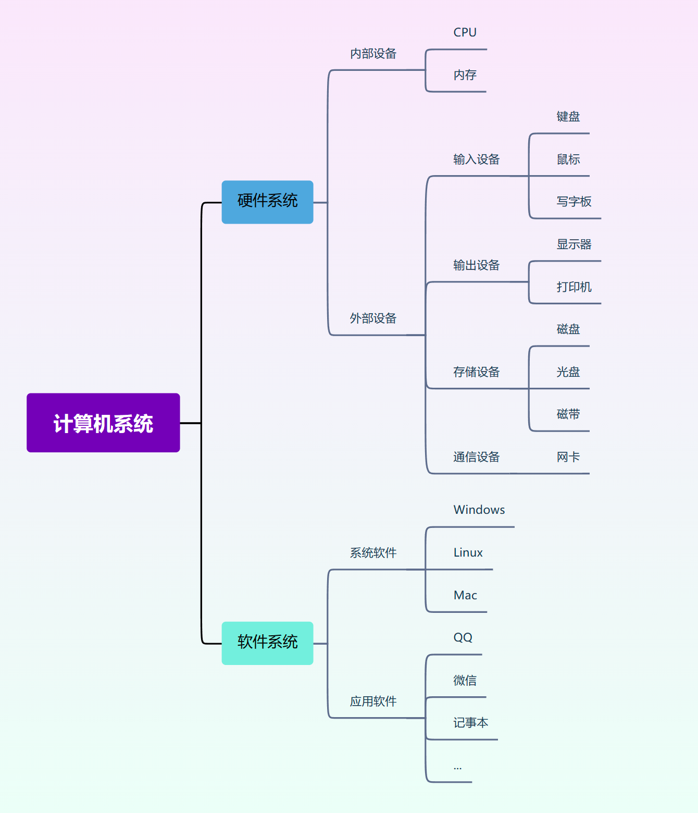

### 1.1.3 计算机硬件组成

计算机硬件有五大部分：

- **控制器**：计算机的指挥系统。控制器通过地址访问存储器，从存储器中取出指令，经译码器分析后，根据指令分析结果产生相应的操作控制信号作用于其他部件，使得各部件在控制器控制下有条不紊地协调工作。

- **运算器**：实现算术运算和逻辑运算的部件。 

- **存储器**：是计算机用来存放所有数据和程序的记忆部件。它的基本功能是按指定的地址存（写）入或者取（读）出信息。 计算机中的存储器可分成两大类：一类是**内存储器**，简称**内存**或**主存**；另一类是**外存储器**（辅助存储器），简称**外存**或**辅存**。 存储器由若干个存储单元组成，每个存储单元都有一个地址，计算机通过地址对存储单元进行读写。一个存储器所包含的字节数称为存储容量，单位有B、KB、MB、GB、TB等。

- **输入设备**：是向计算机中输入信息（程序、数据、声音、文字、图形、图像等）的设备。常见的输入设备有：键盘、鼠标、图形扫描仪、触摸屏、条形码输入器、光笔等。 外存储器也是一种输入设备。 

- **输出设备**：主要有显示器、打印机和绘图仪等。外存储器也当作一种输出设备。

控制器+运算器=CPU，**CPU、内存(主存储器)以及其他I/O设备都由一条系统总线（bus）连接起来并通过总线与其他设备通信**，简单示意图如图所示：

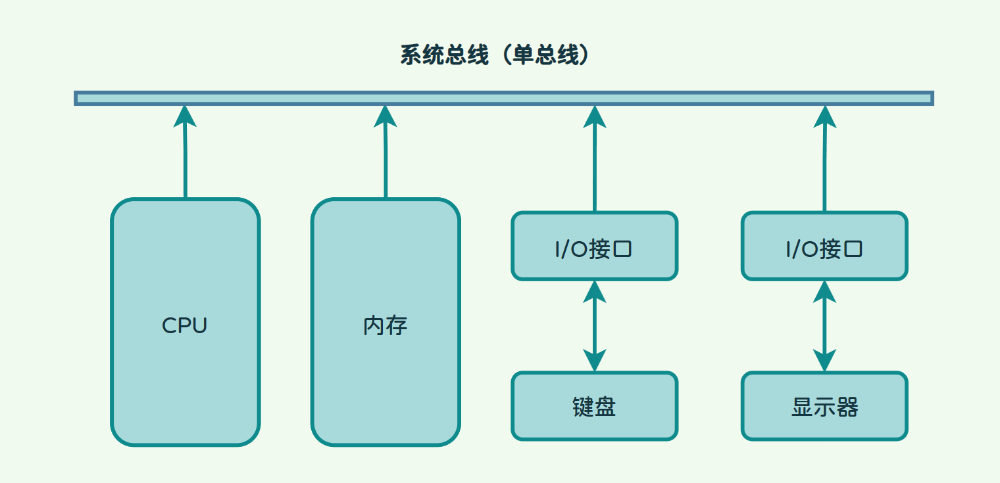

关于一些主要部件的描述如下：

- CPU：类似于人的大脑，负责控制全身和运算。
- 主存：主存（内存）是人的记忆，负责临时存储。
- 输入设备（Input）：是耳朵或眼睛或嘴巴，负责接收外部的信息存入内存，如键盘、鼠标、话筒、写字板等用于接收外部信息指令的设备。
- 输出设备（Output）：是你的脸部（表情）或者屁股，负责经过处理后输出的结果，如显示器、打印机等设备。

以上所有的设备都通过总线连接，总线相当于人的神经。现代计算机的结构更复杂，包括**多重总线**。

下面我们可以通过一个实际案例来模拟一些计算机的工作原理。

上课开始，老师讲课，学生听课，老师是程序员，学生是计算机，学生的器官都是计算机各部分组成。

（1）你通过耳朵接收老师讲的知识（输入）。

（2）通过自己的神经，将接收的数据存入自己的内存/短期记忆（总线、内存）。

（3）光听不行，你还需要反应（处理）老师讲的知识，于是你的大脑（cpu）从短期记忆里取出知识（指令），分析知识（指令），然后学习知识/执行指令 （cpu取指、分析、执行）。

（4）你通过作业或者说话输出你学到的结果。

（5）你想要永久将知识保存下来，只能拿出一个笔记本，把刚刚学会的知识都写到本子上，这个本子就是硬盘（磁盘）。

综合上面所说的，我们知道其实计算机是由五大单元：**CPU（控制单元、算术逻辑单元）、主存储器、输入单元、输出单元**构成的。也可以说CPU+主存储器+输入输出构成了电子计算机的三大核心组件，如下：

（1）控制单元+算数逻辑单元=CPU 。

（2）主存储器，即内存。

（3）输入单元Input+输出单元Output=IO设备。

## 1.2 进制

进制也就是进位计数制，是人为定义的带进位的计数方法。 对于任何一种进制---X进制，就表示每一位置上的数运算时都是逢X进一位。十进制是逢十进一，十六进制是逢十六进一，二进制就是逢二进一，以此类推，x进制就是逢x进位。

### 1.2.1 十进制

由于人类解剖学的特点，双手共有十根手指，故在人类自发采用的进位制中，十进制是使用最为普遍的一种。成语“屈指可数”某种意义上来说描述了一个简单计数的场景，而原始人类在需要计数的时候，首先想到的就是利用天然的算筹——手指来进行计数。

数值本身是一个数学上的抽象概念。经过长期的演化、融合、选择、淘汰，系统简便、功能全面的十进制计数法成为人类文化中主流的计数方法，经过基础教育的训练，大多数的人从小就掌握了十进制计数方法。盘中放了十个苹果，通过数苹果我们抽象出来“十”这一数值，它在我们的脑海中就以“10”这一十进制编码的形式存放和显示，而不是其它的形式。从这一角度来说，十进制编码几乎就是数值本身。

十进制的基数为10，数码由0-9组成，计数规律**逢十进一**。

十进制数：

```shell
0,1,2,3,4,5,6,7,8,9,10,11,12,13,14,15,16,17,18,19,20,21,22,23...
```

### 1.2.2 二进制

二进制有两个特点：它由两个数码0，1组成，二进制数运算规律是**逢二进一**。

为区别于其它进制，二进制数的书写通常在数的右下方注上基数2，或在后面加B表示，其中B是英文二进制`Binary`的首字母。

例如：二进制数10110011可以写成$(10110011)_2$，或写成`10110011B`。对于十进制数可以不加标注，或加后缀D，其中D是英文十进制Decimal的首字母D。

- 二进制数：

```shell
0,1,10,11,100,101,110,111,1000,1001,1011,1100,1101,1110,1111,10000,10001,10010,10011,10100,10101,10110...
```

### 1.2.3 八进制

由于二进制数据的基数R较小，所以二进制数据的书写和阅读不方便，为此，在小型机中引入了八进制。八进制的基数R=8=2^3，有数码0、1、2、3、4、5、6、7，并且每个数码正好对应三位二进制数，所以八进制能很好地反映二进制。八进制用下标8或数据后面加O（Octal ）表示 例如：二进制数据 $(11 101 010 . 010 110 100)_2$ 对应八进制数据 $(352.264)_8$或`352.264O`。

- 八进制数：

```shell
0,1,2,3,4,5,6,7,10,11,12,13,14,15,16,17,20,21,22,23,24,25,26,27,30,31,32,33...
```

### 1.2.4 十六进制

由于二进制数在使用中位数太长，不容易记忆，所以又提出了十六进制数。十六进制数有两个基本特点：它由十六个数码：数字0～9加上字母A-F组成（它们分别表示十进制数10～15），十六进制数运算规律是逢十六进一，即基数R=16=2^4，通常在表示时用尾部标志H或下标16以示区别，在c语言中用添加前缀0x以表示十六进制数。

例如：十六进制数`4AC8`可写成$(4AC8)16$，或写成`4AC8H`、`0x4AC8`。

- 十六进制数：

```shell
0,1,2,3,4,5,6,7,8,9,a,b,c,d,e,f,10,11,12,13,14,15,16,17,18,19,1a,1b,1c,1d,1e,1f,20,21,22,23...
```

## 1.3 进制转换

### 1.3.1 位权

一个十进制数110，其中百位上的1表示1个$10^2$，既100，十位的1表示1个$10^1$，即10，个位的0表示0个$10^0$，即0。

一个二进制数110，其中高位的1表示1个$2^2$，即4，低位的1表示1个$2^1$，即2，最低位的0表示0个$2^0$，即0。

一个八进制数110，其中高位的1表示1个$8^2$，即64，低位的1表示1个$8^1$，即8，最低位的0表示0个$8^0$，即0。

一个十六进制数110，其中高位的1表示1个$16^2$，即256，低位的1表示1个$16^1$，即16，最低位的0表示0个$16^0$，即0。

可见，在数制中，各位数字所表示值的大小不仅与该数字本身的大小有关，还与该数字所在的位置有关，我们称这关系为数的**位权**。

> Tips：十进制数的位权是以10为底的幂，二进制数的位权是以2为底的幂，八进制数的位权是以8为底的幂，十六进制数的位权是以16为底的幂。数位由高向低，以降幂的方式排列。

### 1.3.2 按权求和计算

二进制数、八进制、十六进制数转换为十进制数的规律是相同的。把x进制数按位权形式展开多项式和的形式，求其最后的和，就是其对应的十进制数——简称“**按权求和**”也叫按权展开计算法。

- 2进制转10进制如图所示：

$$
(10101.01)_2转10进制：
$$

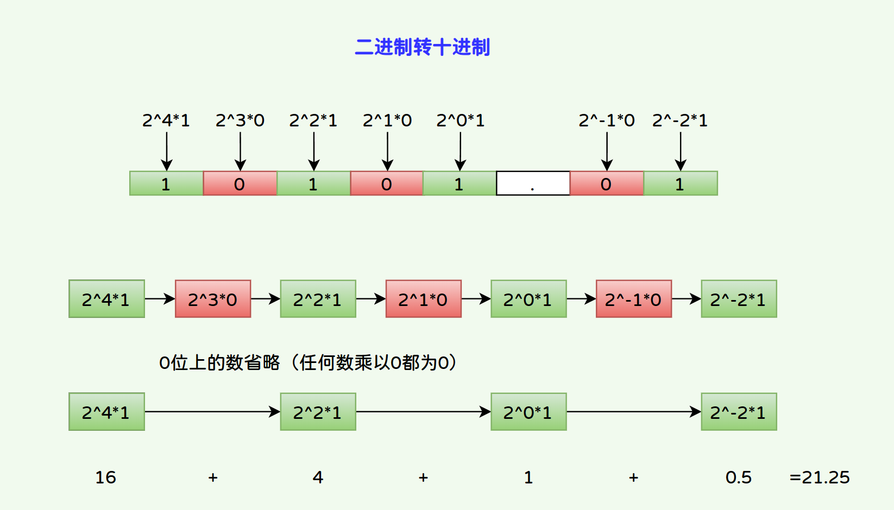

最终求得结果：$(10101.01)_2$=(21.25)10

- 8进制转10进制如图所示：

$$
(306)_8转10进制
$$

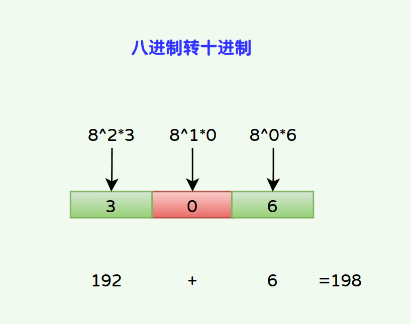

最终求得结果：$(306)_8$=(198)10​

- 16进制转10进制如图所示：

$$
(1a8)16转10进制
$$

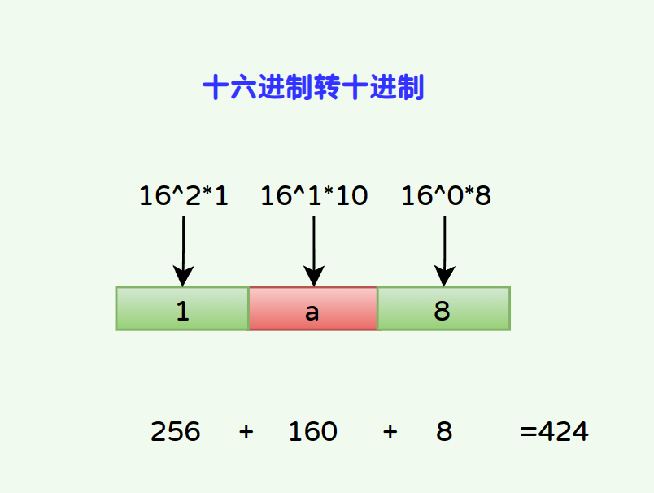

最终求得结果：(1a8)16=(424)10

### 1.3.3 倒数取余计算

一个10进制数转换为一个R进制数采用除以R取余法，即用R连续除以10进制，直到商为0，最终按照倒序的方法得到余数即可，这种简单的计算方法我们陈伟倒数取余法。

> Tips：R表示进制，10进制转换为2进制则一直除以2得到余数，然后倒数取余，10进制转换为8进制则一直除以8得到余数之后倒数取余，以此类推。

10进制转2进制如图所示：
$$
25D转二进制
$$

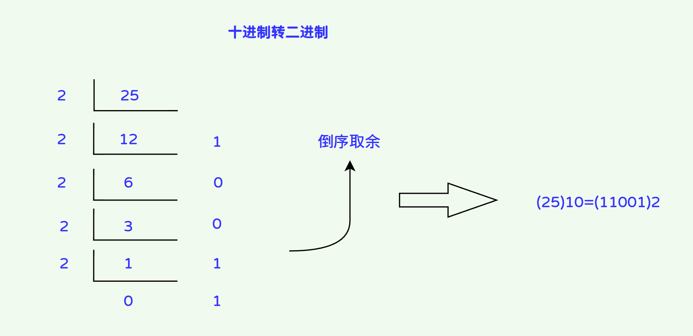

10进制转8进制如图所示：
$$
90D转八进制
$$

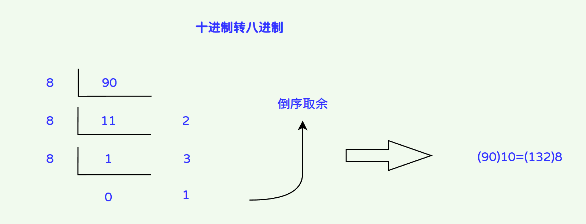


10进制转16进制如图所示：
$$
298D转十六进制
$$

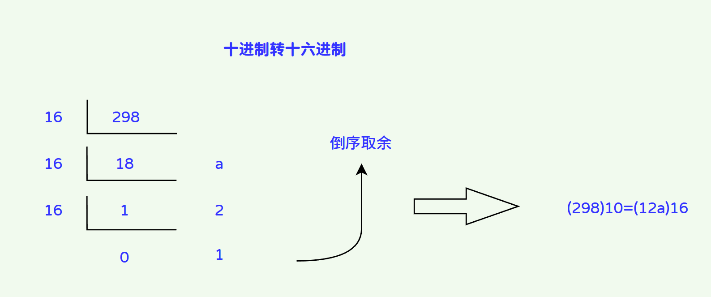

## 1.4 编码与解码的概念

我们都知道计算机底层采用的是二进制码，即计算机底层存储的全都是0和1，不管是我们看到的视频、图片、音乐、文档和其他任何存储在电脑上的文件，其底层都是0，1，那么为什么要采用0和1来进行存储呢？这些0和1在计算机底层又是如何存储的呢？0和1又是如何变成我们需要的文件呢？

### 1.4.1 CPU的计算

我们知道计算机底层都是靠CPU来进行运算的，CPU的发展经历了如下几个过程，如图所示：

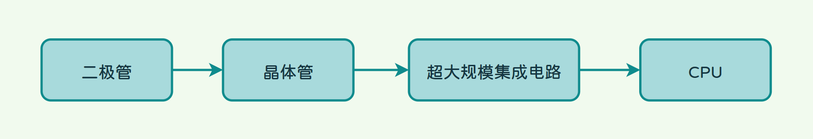

也就是说CPU最原先是通过二极管发展而来，我们可以把这些二极管看做是一个一个的开关，这些开关只有两个状态：通（1）、断（0），那么1个二极管能够表示几种状态呢？很明显就两种，0和1。

2个二极管可表示4个状态：

```shell
00,01,10,11
```

3个二极管可表示8个状态：

```shell
000,001,010,011,100,101,110,111
```

4个二极管就可表示16个状态，5个表示32个状态，6表示64个状态…一个CPU拥有的晶体管越多，电流在一个时间单位上流动的分支越多，从宏观上讲，可以在CPU上处理的数据越多，机器就越快。目前CPU都集成了超大规模的集成电路，多大呢？早在2012年Intel发布的Core i7处理器的芯片集成度达到了14亿个晶体管，数据计算能力可想而知。

就简单而言，这些晶体管就是微型的电子开关，它们是构建CPU的基石。当计算机从内存中读取到指令后（0、1），将其转换为电信号，1则表示高电频，0则表示低电频，通过一些与门，或门，与或门等逻辑控制电路。而计算机内部有超大规模的集成电路，也就可以接受非常庞大规模的数据进行计算，把处理好的数据通过同样的方式将这些信号进行转换写进内存、然后再写出磁盘、麦克风、显示器等外部设备。

> Tips：计算机相关的硬件设备（以及各项电子设备）的工作原理涉及到电路、模拟信号、数字信号、计算机组成原理等诸多计算机/电子信息等专业课程，不在本书研究范围内，大家有兴趣可以自行查看相关书籍的内容来了解这部分知识。到目前为止，我们只需要大致了解到CPU内部是一块超大规模的集成电路板（虽然远不止这么简单），并且能进行计算即可。

**那么计算机中存储的二进制是如何转变为我们看到的内容呢？**

这中间就存在一个编码与解码的过程，其实我们在计算机中打开任何的一个文件、应用程序、游戏等其实都可以看做是一个解码的过程，只不过对应的解析器不同罢了。

### 1.4.2 文本的编码与解码

以最普通的文本为例，我们跟计算机双方约定好当在键盘上输入一个字母A时，保存到电脑上的内容就为0100 0001，当我们在电脑上输入一个字母B时，电脑底层存储的就是0100 0010，越来越多的信息需要通过编码存储到计算机内，因此编码表这个概念就出来了，世界上的一些权威组织就开始着手于编码的制作，有了编码表我们就能够使用0和1来代表世间上的万物了。编码表就相当于一个翻译官，充当人类与计算机之间的一个翻译官。

当我们打开计算机中的记事本输入内容后保存到文件时，过程如图所示：

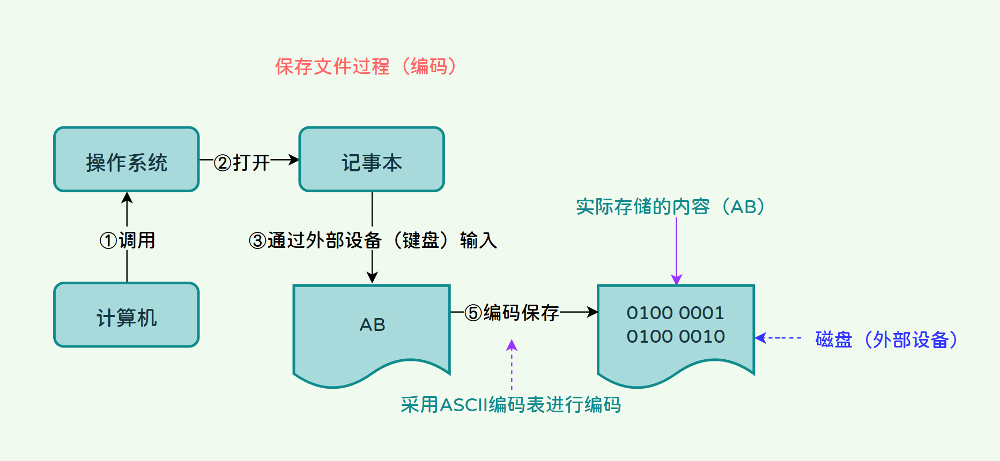

当我们打开计算机中的记事本查看文件中的内容时，过程如图所示：

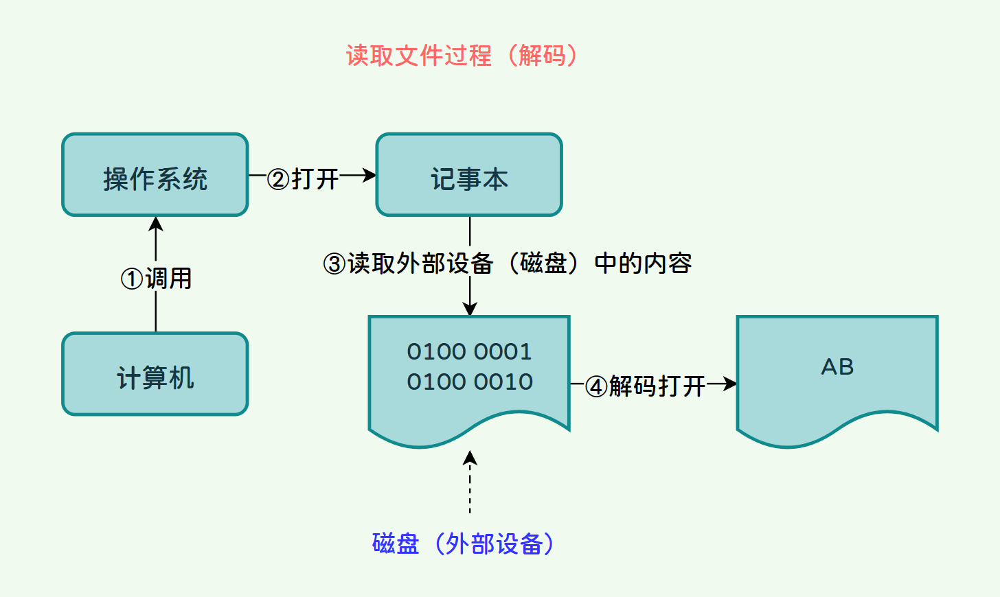

市面上有非常多的编码表，每个表码表的编码内容以及规则是不一样的，因此我们存储到计算机时采用的编码表应该与我们取出数据解码时的编码表一致。

目前计算机中用得最广泛的字符集及其编码，是由美国国家标准局(ANSI)制定的ASCII码（American Standard Code for Information Interchange，美国标准信息交换码），它已被国际标准化组织（ISO）定为国际标准，称为ISO 646标准。适用于所有拉丁文字字母，ASCII码有7位码和8位码两种形式。

- 标准ASCII码：标准ASCII码也叫基础ASCII码，使用7位二进制数来表示所有的大写和小写字母，数字0到9、标点符号，以及在美式英语中使用的特殊控制字符等。7位可以表示128种状态，每种状态都唯一地编为一个7位的二进制码，对应一个字符（或控制码），这些码可以排列成一个十进制序号0～127，所以在7位二进制码种，最多可以表示128个字符。
- 扩展ASCII码：扩展ASCII 字符是从128到255（0x80-0xff）的字符。许多基于x86的系统都支持使用扩展ASCII。它将每个字符的第8位用于确定附加的128个特殊符号字符、外来语字母和图形符号。针对扩展的ASCII码，不同的国家有不同的字符集，所以它并不是国际标准。

ASCII第一次以规范标准的型态发表是在1967年，最后一次更新则是在1986年，至今为止共定义了128个字符（标准ASCII码），当初的设计并没有考虑欧洲那些扩展的拉丁字母，也没有考虑韩语和日语和中文汉字等。因此各个国家开始着手制定自己的字符编码，例如 ISO/IEC 8859（欧洲字符集）、shift_Jis（日语字符集）、GBK（中文字符集）等。

一般的外国人用的数字和字母有限，根据ASCII表来编码，1个字节可以表示完全。我们中国人大部分用的是汉字，所以引入了GB2312编码表，国标（6000多个汉字），一个汉字用2个字节表示。随后又扩展了GBK，扩展编码，能够达到几万个汉字。例如在ASCII编码表中，“65（十进制）”代表字母“A”，在GBK编码表中“CED2（十六进制）”代表中文汉字“我”。

下表是标准ASCII编码表中规范的部分字符内容：

| 二进制    | 十进制 | 字符 |
| --------- | ------ | ---- |
| 0100 0001 | 65     | A    |
| 0100 0010 | 66     | B    |
| 0100 0011 | 67     | C    |
| 0100 0100 | 68     | D    |
| 0100 0101 | 69     | E    |
| 0100 0110 | 70     | F    |
| 0100 0111 | 71     | G    |

下表是GBK编码表中规范的部分字符内容：

| 二进制            | 十六进制 | 字符 |
| ----------------- | -------- | ---- |
| 10110100 11110011 | B4F3     | 大   |
| 10111100 11010010 | BCD2     | 家   |
| 10111010 11000011 | BAC3     | 好   |

### 1.4.3 图片的编码与解码

了解完二进制是如何转成文本后，我们接着学习二进制是如何转成图片的，学习二进制是如何转成图片之前我们必须了解一些前置知识。

#### 1. 三原色

人眼对红、绿、蓝最为敏感，人的眼睛像一个三色接收器的体系，大多数的颜色可以通过红、绿、蓝三色按照不同的比例合成产生。同样，绝大多数单色光也可以分解成红、绿、蓝三种色光，这是色度学的最基本的原理，也称三原色原理（以上介绍摘抄与百度百科）。

在计算机中可以使用十六进制表示法来表示一种颜色（取值范围为`00~FF`），如：`#FFFFFF`；其中前两位表示红色数组，中间两位表示绿色数值，最后两位表示蓝色数值。或10进制表示法，如：RGB(255,255,255)，取值范围为`0~255`，颜色数值依次为(红,绿,蓝)。

> Tips：十六进制表示法需要在前面加上“#”，例如：`#FF0000`。

大多数的一些软件或网站在设置颜色时都会提供如图所示的颜色调色板，每一个十进制的颜色数值都会对应一个十六进制的颜色数值：

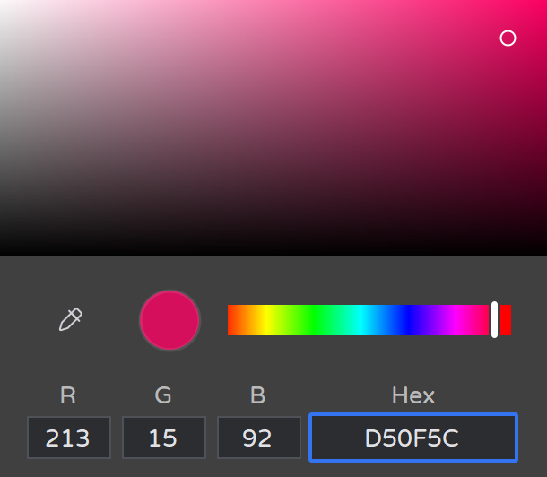

常用的颜色如表所示：

| 十六进制颜色代码 | 十进制颜色代码   | 颜色 |
| ---------------- | ---------------- | ---- |
| #FF0000          | RGB(255,0,0)     | 红色 |
| #00FF00          | RGB(0,255,0)     | 绿水 |
| #0000FF          | RGB(0,0,255)     | 蓝色 |
| #FFFFFF          | RGB(255,255,255) | 白色 |
| #000000          | RGB(0,0,0)       | 黑色 |
| #00FFFF          | RGB(0,255,255)   | 青色 |
| #FF00FF          | RGB(255,0,255)   | 紫色 |
| #FFFF00          | RGB(255,255,0)   | 黄色 |

通过数值的调整，我们可以调整出自然界中绝大多数的颜色。将颜色的十六进制或者十进制转换为二进制后，就是这个颜色在计算机中底层存储的形式。

例如：白色十六进制是#FFFFFF，将其转换成二进制是11111111 11111111 11111111。红色十六进制是#FF0000，转换后是11111111 00000000 00000000。绿色十六进制是#00FF00，转换后是00000000 11111111 00000000。

#### 2. 分辨率

分辨率：图像处理和显示技术中，分辨率通常指图像的清晰度，即图像中可以分辨的最小细节。一张图片是由若干个像素点组成的，分辨率决定了这些像素点的排列以及数量，如图所示。


以一张1920×1080分辨率的图片为例，其横向排列1920个像素点，纵向排列1080个像素点，每一个像素点都是有三原色混合而成的一种特定颜色，这些颜色可以转成对应的二进制码存储在计算机中，像素点以特定的方式排列在指定的位置，就组成了一张完整的图片。

图片由大量的像素点组成，每个像素要用到24位比特（3个字节），那么一张1920×1080的图片大小为1920×1080×3=6,220,800字节≈6MB，占用的空间非常大。因此图片会有各种压缩算法，在尽量保证不失真的情况下把体积压到最小，常见的JPG、PNG等就是常见的图片压缩算法。像素的比特信息经特定算法压缩，就形成了特定格式的图片。


### 1.4.4 视频的编码与解码

在学习二进制是如何转换成视频之前我们必须了解一些前置知识。

- FPS（Frames Per Second）：即每秒传输帧数，视频的本质是一帧一帧的图片切换带来的动画效果，意思是显卡一秒钟能显示多少个画面。一般来说人眼能接受的最低连贯画面是一秒钟24帧，而要达到流畅的程度，那么一秒钟起码要出现30帧才行。

- Hz（hertz）：中文名为赫兹，这个参数出现在显示器时，代表一秒钟内画面能够刷新的次数。我们常见的显示器一般都是60Hz，代表该显示器一秒可以刷新60次画面。

视频画面是否流程，需要FPS和Hz共同的提升。如果显卡帧率输出有60FPS，使用的是120Hz的显示器，这时，我们就会感到画面卡顿，因为显示器每秒可以显示120张画面，而帧率只有60FPS，那么显示器就会造成卡顿现象，如果帧率有120FPS，显示器只支持60HZ，那么这120的帧率也只是浪费，增加了显卡的功耗而已，却并没有改善游戏画质，因为显示器只能显示60张每秒。

但就目前的计算机而言，显卡的输出帧数能力都比较强悍，瓶颈大多都在显示器的刷新率上，所以一般情况下只要解决了显示器的刷新率问题，那么用户整体的体验感就会得到提升。

假设当前显示器的频率为60hz，显卡的输出帧数也是60帧，并且视频的分辨率为1920×1080，假设不使用任何压缩算法，每秒钟输出60张1920×1080的图片（约6MB），就得计算60*6MB≈360MB的数据。而当今主流的游戏笔记本的屏幕刷新率都能达到144hz、240hz，甚至有的都能达到360hz。计算的数据量非常庞大，因此我们要对其进行编码进行数据压缩，以此来降低数据传输和存储的成本，常见的mp4、avi等就是属于视频的编码格式（压缩方式）。需要注意的是，无论如何视频的渲染尤其是高分辨高帧数的视频对CPU以及显卡的计算能力要求都是非常高的。


### 1.4.5 音频的编码与解码

二进制转换音频的过程较为复杂，首先需要将字节码转换为音频信号，其过程如下。

1. 


## 1.5 原码、反码、补码

计算机为了区分数值的正负提出了符号位的设定，计算机用最高位存放符号，这个被称为符号位。正数的符号位为0， 负数的符号位为1。

例如，1的二进制表示形式为`0000 0001`，而-1的二进制表示形式为`1000 0001`。在计算机中，一个字节为8个位，最大值为0111 1111，十进制为127。最小值为1000 0000，十进制为-128。因此一个字节的取值范围为-128~127之间。

### 1.5.1 原码

原码是最直观的表示方法，它直接将数值转换为二进制数，是十进制数在二进制中的体现，该二进制包含符号位。原码就是我们之前使用的二进制的格式，只不过我们之前一直没有使用二进制描述过负数，使用原码描述负数只要将符号位设定为1即可。

但仅仅存在原码对于计算机进行运算时有着巨大缺陷；**那就是对于负数的计算。**

- 对于正数的计算，原码不会有问题，例如计算2+6：

```shell
  0000 0010
+ 0000 0110
-----------------
  0000 1000
```

0000 1000的十进制为8，计算正确。

- 对于负数的运算，发现结果与目标值不对，例如计算2+(-6)：

```shell
  0000 0011 （2）
+ 1000 0110 （-6）
--------------
  1000 1001
```

1000 1001的十进制为-9，计算错误。

**为了解决原码不能用于计算负数的这种问题，因此迫切需要一种新的表示方法来解决这个巨大的缺陷，于是反码出现了。**

> Tips：有些人在这里肯定会有一个疑问，为什么要计算2+(-6)，而不是2-6这样的操作呢？这是因为CPU中只设计了加法器，没有所谓的“减法器”，因此2-6只能看做成2+(-6)这样的操作。

### 1.5.2 反码

反码提供了一种便捷的方法来执行减法操作，这样的设计允许CPU利用已有的加法逻辑来完成减法运算，无需额外的减法器硬件，从而简化了处理器的设计并减少了硬件资源的需求。

#### 1. 反码的转换规则

有了原码之后我们可以根据规则转换成对应的反码，其规则如下：

- 正数的反码：原码本身。
- 负数的反码：原码的符号位不变，其余位取反。

一些数的原码、反码的表示如表所示。

| 十进制数字 | 原码      | 反码      |
| ---------- | --------- | --------- |
| 1          | 0000 0001 | 0000 0001 |
| -1         | 1000 0001 | 1111 1110 |
| 2          | 0000 0010 | 0000 0010 |
| -2         | 1000 0010 | 1111 1101 |

原码转换为反码后，使用反码来进行计算。对于通常的负数计算，使用反码可以完成，例如我们计算2-6。

2的原码为0000 0010，反码为0000 0010。-6的原码为1000 0110，反码为1111 1001，计算如下：

```shell
  0000 0010 (2)
+ 1111 1001 (-6)
-----------
  1111 1011 (-4反码)
  1000 0100 (-4原码)
```

上述案例的计算结果为：1111 1011（反码），转换为原码为：1000 0100，结果为-4，刚好是正确的。

#### 2. 反码的进位

需要注意的是，使用反码计算时，高位进位时需要作用到低位。例如我们换一个数进行计算，计算-4+(-1)。

-4的原码为1000 0100，反码为1111 1011。-1的原码为1000 0001，反码为1111 1110，计算如下：

```shell
  1111 1011 (-4)
+ 1111 1110 (-1)
-----------
  1111 1001 (-6)
          1 (高位进位之后作用到低位,在低位进1位)
-----------
  1111 1010 (-5反码)
  1000 0101 (-5原码)
```

#### 3. 反码的缺陷

反码也有它的缺陷，那就是计算结果为0时。

我们来计算2+(-2)，-2的原码为：1000 0010，反码为：1111 1101。

```shell
  0000 0010 (2)
+ 1111 1101 (-2)
-----------------
  1111 1111 (反码)
  1000 0000 (原码)
```

上述案例计算的结果为1111 1111转回原码为1000 0000，结果为-0。那么问题来了，-0是0吗？在二进制中出现了两个可以描述“0”这个数值的二进制，一个为1000 0000，另一个为0000 0000，“0”这个数字在计算机中的编码就不是唯一的了，这很显然有问题。

### 1.5.3 补码

使用反码表示零时存在两种形式（+0和-0），这在逻辑上不严谨。计算机科学家们意识到这个问题后决定，把0当成正数，即“+0”，也就是0000 0000，此时八位二进制表示的正数范围为：+0到+127。对负数做调整，不能使用1111 1111来表示“-0”，因为不存在“-0”这个数。

1111 1111既然不表示“-0”，也就意味着可以表示其他的数值，因而八位二进制能够表述的数字又多了一位。那如何利用这一位数值呢？我们把基于反码的八位二进制表示的负数整体“向后挪动1位”，负数的取值范围就从-0到-127变为-1到-128。1111 1111不再表示-0了，而是表示-1，以此类推1111 1110表述的就是-2。

那么如何只对负数整体“向后挪动1位”呢？那就是对一个数的反码进行+1操作，如下：

- 1111 1110（-1的反码）+1就是1111 1111，这样1111 1111就不再表示-0而是表示-1。

- 1111 1101（-2的反码）+1就是1111 1110，这样1111 1110就不再表示-1而是表示-2。

就这样，八位二进制数的最小取值范围从-0到127变为了-1到-128。这种基于反码+1的操作就是补码。

#### 1. 补码的转换规则

计算机在进行运算时，先将原码转回为对应的补码。其转换规则如下：

- 正数的补码：原码本身，正数的原码、反码、补码全都一致。
- 负数的补码：原码的反码+1。

一些数的原码、反码、补码的表示如表所示。

| 十进制数字 | 原码         | 反码         | 补码      |
| ---------- | ------------ | ------------ | --------- |
| 1          | 0000 0001    | 0000 0001    | 0000 0001 |
| -1         | 1000 0001    | 1111 1110    | 1111 1111 |
| 2          | 0000 0010    | 0000 0010    | 0000 0010 |
| -2         | 1000 0010    | 1111 1101    | 1111 1110 |
| 127        | 0111 1111    | 0111 1111    | 0111 1111 |
| -127       | 1111 1111    | 1000 0000    | 1000 0001 |
| -128       | 超出表示范围 | 超出表示范围 | 10000000  |

因为补码把“-0”这个位置利用起来了，所以在一个字节下的补码还可以记录一个特殊的值：-128，这个数据在1个字节下是没有原码和反码的。

#### 2. 使用补码计算0

我们使用补码再来计算2+(-2)。

-2的补码为1111 1110。2的原码、反码、补码都为本身，即：0000 0010。计算过程如下：

```shell
  1111 1110 (-2)
+ 0000 0010 (2)
------------
  0000 0000 (0)
```

可以看到，上述的计算结果为0。补码很好的解决了反码相加结果为0的问题。

> Tips：计算机底层存储数据时普遍使用补码形式。补码不仅能够表示正数和负数，还能够让加法和减法运算统一处理，简化了计算流程，并且能够自然地处理溢出情况。在现代计算机体系结构中，无论是整数还是浮点数，通常都采用补码表示法进行存储和运算。因此，无论是内存中的数据存储还是处理器进行的计算，补码都是被广泛采用的表示方法。

#### 3. 补码的注意事项

八位二进制数的取值范围为：-128到+127，那如果计算的结果超出了这个范围又当如何呢？我们思考一个问题：127+1=？。

127的补码为0111 1111，1的补码：0000 0001，计算如下：

```shell
  0111 1111 （127）
+ 0000 0001 （1）
-------------
  1000 0000 （-128）
```

正常来说127+1的结果为128，1个字节的取值范围为-128到127，并不能存储128，因而在1个字节内进行127+1的结果为-128。

不仅127+1=-128，另外-128-1的结果也会发生改变。

-128的补码：1000 0000，-1的补码：1111 1111，相加的运算结果如下：

```shell
  1000 0000 (-128)
+ 1111 1111 (-1)
-------------
  111 1111 （127）
```

上述代码最终计算的结果为127。

## 1.6 存储单位

在计算机科学中，最小的存储单位是位（bit），最小的数据传输单位也是位（bit），它代表了二进制中的一个数字，即0或1。虽然计算机中最小的存储单位是位（bit），但数据存储的基本单位是字节（Byte）。

### 1.6.1 基本的存储单位

各种信息在计算机中存储、处理至少需要一个字节。例如，一个ASCII码用一个字节表示，一个汉字用两个字节表示。在实际应用中，字节是衡量存储容量的常用单位，例如KB（千字节）、MB（兆字节）、GB（吉字节）等。

我们可以在计算机的任意文件或文件夹处右击，选择属性，查看该文件或文件夹的大小，如图所示。

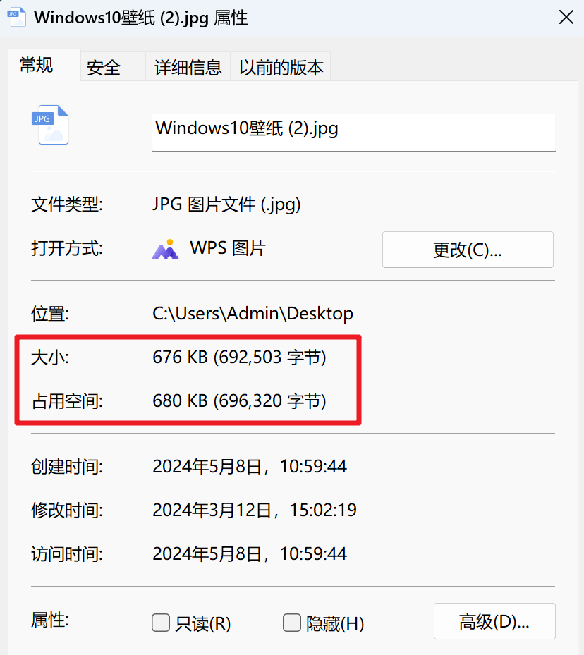

> Tips：如图，我们发现文件实际的大小和占用的空间并不是一致的，这通常是由于存储方式不同造成的。
>
> - 文件大小：文件大小是指文件的实际数据大小，通常以字节为单位计算。文件大小并不考虑存储该文件所需的磁盘空间大小，而只是计算文件中实际数据所占用的大小。
>
> - 占用空间：占用空间则是指存储该文件所需的磁盘空间大小，包括文件的实际数据大小以及文件系统在磁盘上分配的额外空间。这个额外空间包括簇、块、扇区等，用于文件系统管理文件的方式，以及文件系统记录文件元数据的空间，如文件名、创建时间、修改时间等信息。
>
> 在某些情况下，文件系统的簇大小会大于文件本身的大小，这意味着一个小文件也需要使用一个完整的簇进行存储。这可能会导致文件占用的空间比文件大小要大得多。此外，删除文件时，文件系统可能不会立即释放该文件所占用的所有磁盘空间，而是将它们标记为可用空间，并在以后的文件存储中重复利用。
>
> 因此，文件大小和占用空间之间的差异可能会因文件系统的不同而异。在某些情况下，这个差异可能不明显，而在其他情况下则可能很大。在计算磁盘空间时，应考虑文件系统的使用情况和特征，以便更准确地计算出文件的占用空间。

### 1.6.2 其他存储单位

在计算机各种存储介质（例如内存、硬盘、光盘等）的存储容量表示中，用户所接触到的存储单位不是位、字节，而是KB、MB、GB等，但这不是新的存储单位，而是基于字节换算的。

1B=8bit。

KB：1KB=1024B 。早期用的软盘有360KB和720KB的，不过软盘已经很少使用。

MB：1MB=1024KB。早期微型机的内存有128MB、256MB、512MB，目前内存都是16GB、32GB甚至更大。

GB：1GB=1024MB。早期微型机的硬盘有60GB、80GB，目前都是512GB、1TB甚至更大。

TB：1TB=1024GB。目前个人用的微型机存储容量也都能达到这个级别了，而作为服务器或者专门的计算机，不可缺少这么大的存储容量。

存储单位之间的换算率约等于1000（1024），从大到小顺序为T、GB、MB、KB、B再小就是位了。

计算机存储单位一般用bit、B、KB、MB、GB、TB、PB、EB、ZB、YB、BB、NB、DB……来表示，它们之间的关系如表所示。

| 转换率           | 单位 |
| ---------------- | ---- |
| 一个二进制，0或1 | bit  |
| 1B=8bit          | B    |
| 1MB=1024B        | MB   |
| 1GB=1024MB       | GB   |
| 1TB=1024GB       | TB   |
| 1PB=1024TB       | PB   |
| 1EB=1024PB       | EB   |
| 1ZB=1024EB       | ZB   |
| 1YB=1024ZB       | YB   |
| 1BB=1024YB       | BB   |
| 1NB=1024BB       | NB   |
| 1DB=1024NB       | DB   |

> Tips：计算机最小的存储单位虽然是位（bit），但是计算机的基本存储单位是字节，又名Byte，用大写字母B表示。

## 1.7 常用DOS命令

DOS是Disk Operating System的缩写，即磁盘操作系统。它是一个基于磁盘管理的操作系统，在微软公司的Windows 2000出版之前，DOS系统基本统治着个人操作系统世界。即便是Windows3.x/9x都是建立在DOS平台之上的大型GUI界面应用程序。作为一个程序设计者，有必要对常用DOS命令进行一些了解与学习。

回到桌面，按下`windows+R`键，如图所示。

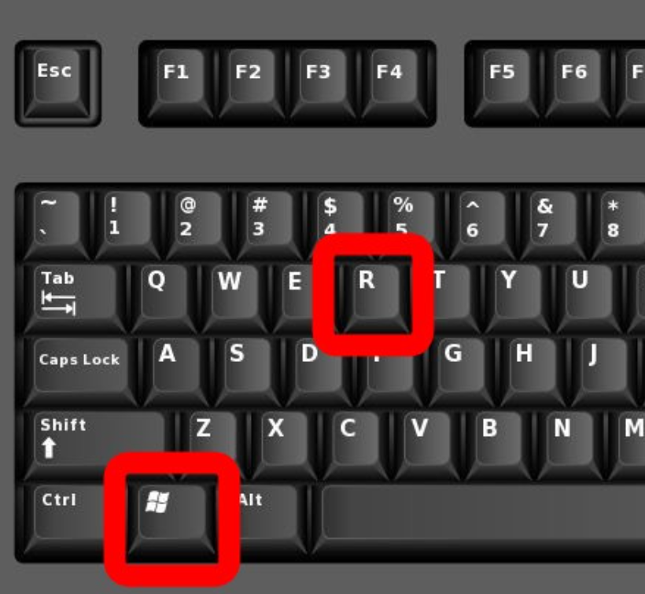

在弹出的运行框中输入cmd，然后点击确认，如图所示。

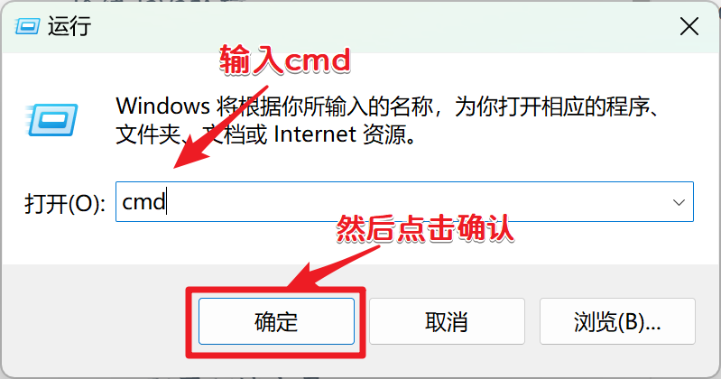

之后便弹出了cmd窗口，如图所示：

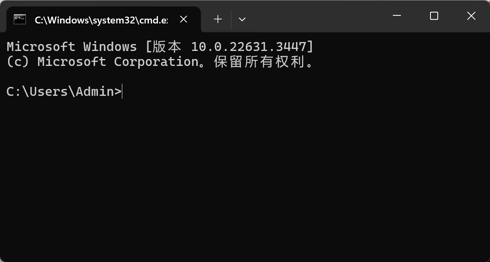

Dos常用命令如表所示。

| **命令**    | **解释**           |
| ----------- | ------------------ |
| 盘符名：    | 盘符切换           |
| dir         | 查看当前文件夹内容 |
| cd 文件夹名 | 进入指定文件夹     |
| cd..        | 返回上一级文件夹   |
| cd\         | 退出到磁盘根目录   |
| cls         | 清屏               |

> Tips：我们只需要掌握一些常用的cmd命令即可，这些常用的dos命令用法也非常简单，在本书后续章节中会有一些具体用法，本章不过多赘述。

# 第2章 Java入门

本章节我们正式进入Java世界的大门，在本章我们会了解编程语言相关的概念与Java的发展历程，了解Java相关行业知识，搭建Java开发环境，并掌握Java的跨平台相关原理知识。最后学习如何编写Java程序，如何运行Java代码。通过本章的学习我们将逐步踏入Java世界，编写我们人生中的第一个Java程序！

## 2.1 编程语言的概念

程序设计语言是人们为了描述解题步骤（即编程序）而设计的一种具有语法语义描述的记号。计算机语言的种类非常的多，总的来说可以分成**机器语言，汇编语言，高级语言**三大类。

在计算机角度，每一种CPU类型都有自己可以识别的一套指令集，计算机不管你这个程序是用什么语言来编写的，其最终只认其CPU能够识别的二进制指令集。

### 2.1.1 机器语言

在早期计算机刚发展的时代，人们都是直接输入01010101这样的没有语义的二进制指令（俗称机器语言）来让计算机工作的，可读性几乎没有，没人愿意直接编写那些没有可读性、繁琐、费时，易出差错的二进制01代码，所以后来才出现了编程语言（包括汇编与高级语言）。

> Tips：编程语言的诞生，使得人们编写的代码有了可 读性，有了语义，与直接用01相比，更有利于记忆。

机器语言执行过程如图所示。

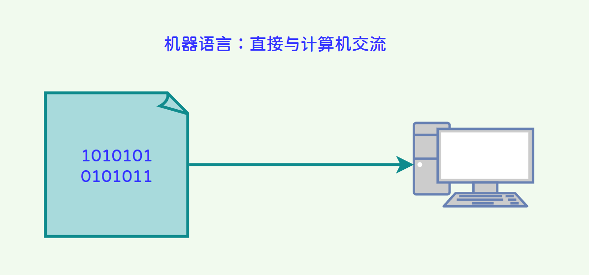

机器语言的特点是：代码编写复杂、易错、没有语义，对程序员非常不友好，但由于是机器指令，可以直接被计算机所识别，效率高。

### 2.1.2 汇编语言

为了克服面向CPU的指令集的难读、难编、难记和易出错的缺点，后来就出现了面向特定CPU的特定汇编语言，比如打上这样的x86汇编指令`mov `、`ax`，然后用上用机器码做的汇编器，它将会被翻译成 1000100111011000 这样的二进制01格式的机器指令。

汇编语言执行过程如图所示。

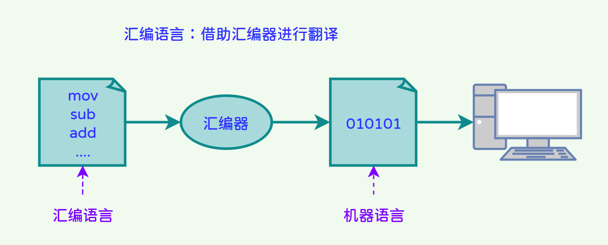

汇编语言的特点是：相对于机器指令而言，代码编写较为简单，程序被赋予了语义，对程序员友好，代码需要借助汇编器转换为机器指令，效率比机器指令略低。

汇编的实质是机器指令（机器码）的助记符，是一种低级符号语言，机器指令集是一款CPU的编程特征，是这款CPU的设计者制定的，CPU的内部电路设计就是为了实现这些指令集的功能。每种CPU架构都有自己的指令集，这些指令集决定了CPU能够执行哪些操作以及如何执行这些操作。因此，不同的CPU架构会有不同的汇编语法和编译器。

CPU常见的架构有：arm架构，x86架构，mips架构等，汇编语言是针对某一个CPU而写的，不能编译到另一个CPU。例如： `add eax,ebx`就只是X86 汇编的。而mips的，可能是`add $t0,$t0,$t1`。

不同CPU架构上的汇编语言指令不同，不同操作系统之间的指令也可能不一样，而为了统一一套写法，同时又不失汇编的表达能力，因此高级编程语言就诞生了。

### 2.1.3 高级语言

用高级语言写的代码（以C语言举例），首先会被高级语言的编译器先编译成当前符合CPU架构的汇编指令，然后再将该汇编指令转成CPU能识别的机器码，最终交由计算机解释执行。

高级语言执行过程如图所示。

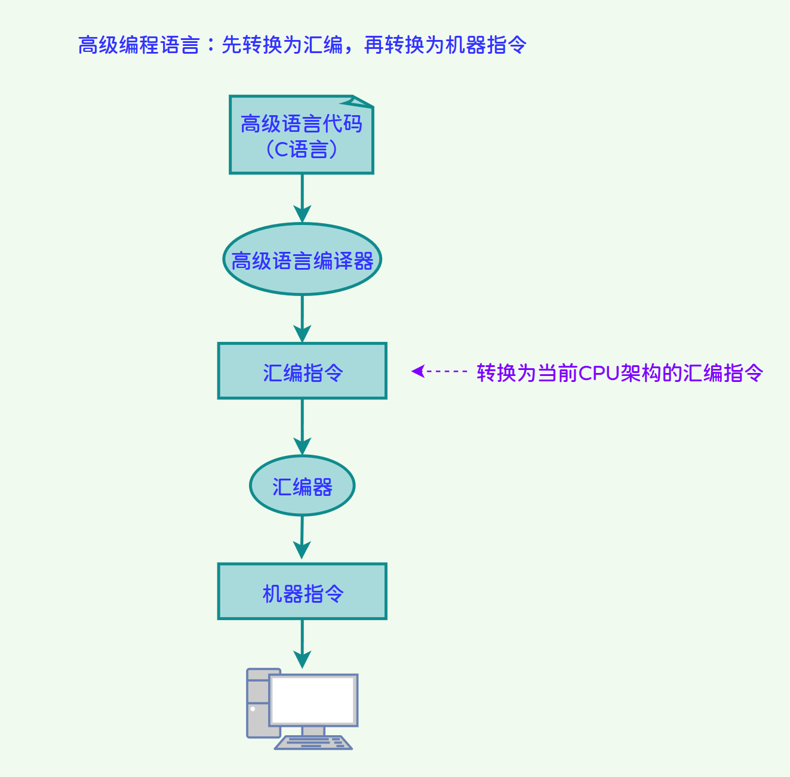

有了高级语言我们就不需要去阅读特定CPU的汇编码，只需要写通用的高级语言的源代码就可以实现程序的编写，借助高级语言的编译器就可以实现跨CPU的代码编写。

我们用将更偏机器实现的汇编语言称为低级语言，与汇编相比之上的语言，我们称之为高级语言。

机器语言、汇编语言、高级语言三者的对比如表所示。

| 对比维度   | 机器语言             | 汇编语言                 | 高级语言                 |
| ---------- | -------------------- | ------------------------ | ------------------------ |
| 设计目的   | 直接与计算机硬件交互 | 简化机器语言编程         | 接近自然语言编程         |
| 语法复杂度 | 高（二进制代码）     | 中（符号化的机器指令）   | 低（接近自然语言）       |
| 执行效率   | 最高（直接执行）     | 较高（需汇编成机器语言） | 较低（需编译成机器语言） |
| 可读性     | 低                   | 中                       | 高                       |
| 可移植性   | 低                   | 中                       | 高                       |
| 直接执行性 | 是                   | 否                       | 否                       |
| 需要翻译   | 否                   | 是                       | 是                       |
| 示例语言   | 无特定名称           | 汇编语言（assembly）     | BASIC, C, Java, Python等 |
| 适用场景   | 直接控制硬件         | 优化机器语言程序         | 大多数编程任务           |

### 2.1.4 语言的跨平台特性

我们知道，不管是高级语言还是汇编语言最终将被翻译成0101这样的机器指令交由CPU执行。不同的CPU架构解释的机器指令是不一样的。假设我们利用汇编指令编写好了一个基于x86架构的CPU的汇编程序，那么该汇编程序就无法在使用了arm架构的CPU的计算机上执行。那么如何统一一套写法可以在不同的CPU架构的计算机上执行呢？这就是我们要考虑的语言的跨平台特性。即程序代码只编写一次，但可以在不同的平台（CPU的架构）执行该程序。

不难发现，高级语言（例如C）就是具备了跨平台的特性。假设我们使用C语言编写好了一个hello程序，我们需要安装好当前CPU架构的编译器，例如x86的编译器，然后将C语言编写的hello程序编译成符合x86架构的汇编指令，最后由汇编器编译成x86架构的机器指令执行。如果需要将该hello程序运行在arm架构的CPU上，我们只需要安装arm架构的编译器，将该hello程序的源代码编译成符合arm架构的汇编指令，最终再由汇编器编译成arm架构的机器指令即可。

高级语言跨CPU的实现如图所示。

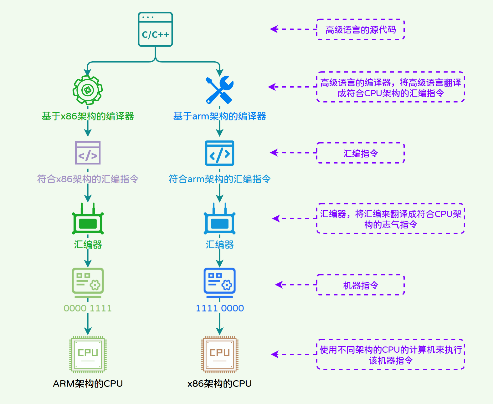

高级语言（例如C）在编译成汇编指令或执行该汇编指令时，编译器与指令需要与操作系统做交互，不同的操作系统提供的系统API、系统的资源管理等都会有所不同，因此高级语言在编译成汇编时不仅要考虑CPU架构（该编译器要符合CPU架构），还要考虑操作系统的因素。

上面的案例中并没有考虑到操作系统的因素。实际上，C语言编写的源代码程序想要在windows平台运行还要考虑到操作系统的因素，那么完整的说法应该是需要安装windows平台基于x86架构的编译器，才能在使用了x86架构的CPU并安装了windows操作系统的计算机上运行该程序，如图所示。

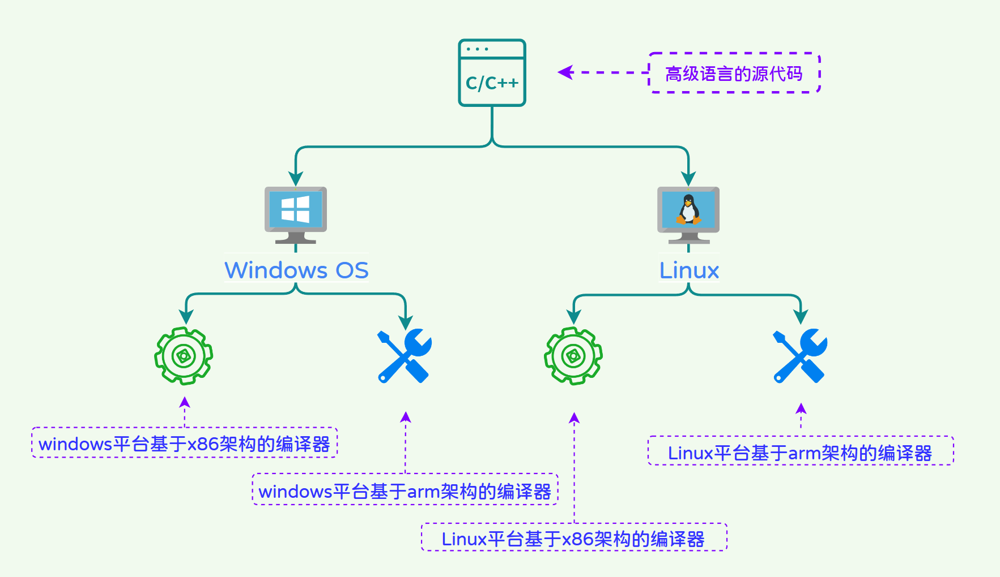

这样一看是不是太混乱了？想要做到跨平台也太麻烦了吧？如果CPU的架构再多几个，操作系统的平台再多几个那么对应的编译器岂不是变得非常多？从原则上来说是的。但是我们要了解一下市场行情就知道“我们所担心的问题”其实并不会出现。

因为当前市场上主要的CPU架构只有x86架构和ARM架构。x86架构是由Intel和AMD两家公司主导的个人电脑和服务器市场的架构，而ARM架构则主要用于移动设备如智能手机和平板电脑，而操作系统的个人PC主要份额都集中在windows，以及一小部分的Linux和Mac等。

而且目前所提倡的面向服务架构、云计算、大数据等通过网络使得软件运营商只要给用户提供客户端的操作界面即可，数据的计算、维护等都交由服务器完成，数据之间的交互没有了编程语言、操作系统、硬件架构的限制。

## 2.2 Java编程语言介绍

Java的雏形诞生于1990年代初，到如今已有30多年的历史。直至今日，Java已经发展为世界上最流行和最受欢迎的编程语言之一，每年有超过数以万计的人在学习Java或从事Java开发相关的工作。Java对整个互联网的影响是巨大的，如电子商务、银行、证券、医疗、游戏、家电、大数据、云计算等行业均有Java的足迹，但Java的涉猎远不止这些行业，它的身影几乎无处不在。

### 2.2.1 Java的发展历史

Java诞生于1991年，来源于名为"Oak"的项目，Oak的目标是作为家用电器等小型系统的编程语言。团队成员有James Gosling、Mike Sheridan、 Patrick Naughton等人。James Gosling是项目负责人，被誉为“Java之父”。

时间到了1994年，Oak项目团队完成了第一个Java需要的网页小程序，在1994年末介于Oak，已经被注册为另一个商标的一部分导致无法继续使用，于是将Oak更名为Java。据说是因为Java是印度尼西亚爪哇岛的英文名称，爪哇岛因盛产咖啡而闻名，Java创始人员团队中其中一名成员想起自己在Java岛（爪哇岛）上曾喝过一种美味的咖啡而提出Oak的新名称。

在1995年初Sun公司正式公开发布Java语言，并且第一次提出了"Write Once，Run Anywhere"（一次编写，到处运行）的口号。此时的Java经过非常火热，但功能却并不是特别完善，缺少强大的核心开发类库。

于是1996年1月23日，Sun公司发布了Java1.0的第一个公开开发工具包，也就是JDK1.0，包含JRE（运行环境）和JDK（开发环境），至此Java语言有了第一个正式版本的运行环境。所以尽管Java是1995年问世，但JDK1.0是在1996年正式发布。

后期Java发展的非常迅速，经历了漫长而丰富的发展历程，从最初的一个小型项目逐渐成长为了全球最流行的编程语言之一，使用的人群以及涉及的领域越来越广泛，每个版本也推出了非常的一些新功能，这些新功能在后续的章节中我们会一一介绍。Java的发展时间轴如图所示。

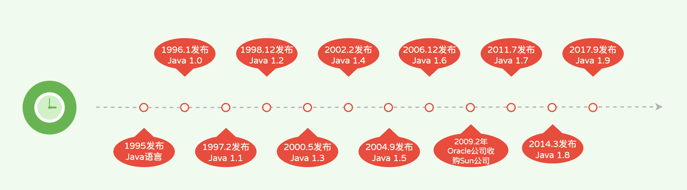

在1998年12月发布里sun公司发布了Java 1.2版本。这个版本Java迎来了一个里程碑式的版本，Sun在这个版本中把Java技术体系拆分为三个方向，分别是面向桌面开发的J2SE、面向企业开发的J2EE、面向移动端开发的J2ME。在这个版本中出现了非常多的代表性技术，如EJB、Java Plug-in、Java IDL、Swing等。

2009年4月20日，Oracle公司以74亿美元的价格收购了市值曾超过2000亿美元的Sun公司。至此Java的所有权由Sun公司转变为了Oracle公司，在Oracle的官网中可以下载Java以及阅读Java的官方文档。

Oracle公司在2017年9月正式发布了Java 9.0版本（也称JDK1.9或Java 9、JDK9等）。从此每六个JDK大版本划出一个三年支持的LTS（Long Term Support）版本（长期支持版本），普通版本只有六个月生命周期，所以以后Java新的版本将总是在每年的3月份和9月份发布。另外JDK8和JDK11是LTS版本。至此开始Java的版本更新的非常迅速。截止到2024年3月份Java已经更新到JDK22了。Java的发展时间轴如图所示，我们只需要重点关注LTS版本即可。

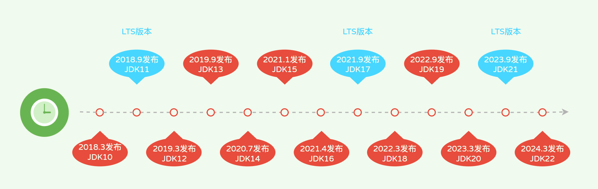

多年来，Java 8一直是领先的Java版本。然而，它的使用率正在逐年下降。这并不奇怪，因为在2022年3月，Java 8失去了Oracle Premier支持。因此，许多开发人员决定将他们的应用程序迁移到不同的版本。Java 17的出现，一个新的长期支持版本，吸引了很多用户。并且在2023年JDK17的使用率已经超过JDK11。

如图所示是Jetbrains idea IDE 对Java各版本的使用统计情况（2021年~2023年）。

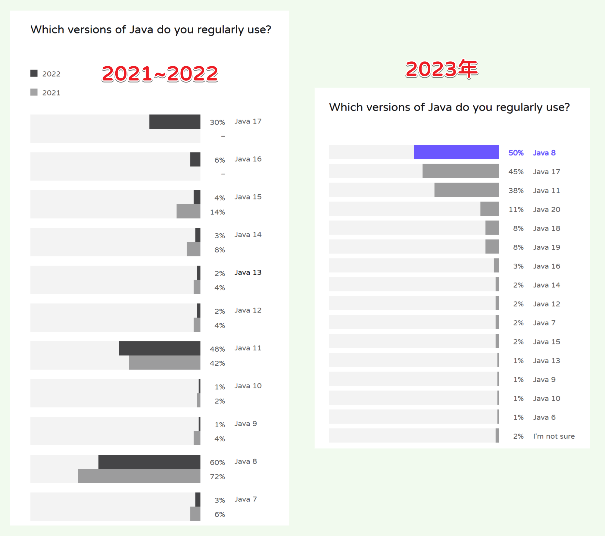

> Jetbrains公司对Java行业的分析可以来到这个网站查询：https://www.jetbrains.com/lp/devecosystem-2023/java/#java_ide

### 2.2.3 Java的平台

在Java 1.2版本中，Sun公司把Java技术体系拆分为三个方向，至此Java平台拥有三个版本，这使软件开发人员、服务提供商和设备生产商可以针对特定的市场进行开发。这三个版本分别是面向桌面开发的J2SE、面向企业开发的J2EE、面向移动端开发的J2ME。

`Java SE（Java Platform，Standard Edition）`：JavaSE或称J2SE。它允许开发和部署在桌面、服务器、嵌入式环境和实时环境中使用的Java应用程序。Java SE包含了支持Java Web服务开发的类，并为Java Platform，Enterprise Edition（Java EE）提供基础。

`Java EE（Java Platform，Enterprise Edition）`：JavaEE或称J2EE。被称为Java企业级开发平台，也是Java技术中使用的最广泛的部分，Java EE是在Java SE的基础上构建的，用来开发B/S架构软件。2017年8月，Oracle公司发布Java EE 8并将Java EE（Java SE还自己保留）交给开源组织，Eclipse基金会接手。但Oracle不允许开源组织使用Java名号，所以从2018年3月开始Java EE更名为Jakarta EE，后续版本称为Jakarta EE，包括2021年推出的Jakarta EE 9和2022年9月月份推出的Jakarta EE 10。

`Java ME（Java Platform，Micro Edition）`：JavaME或称J2ME。Java ME为在移动设备和嵌入式设备（比如手机、PDA、电视机顶盒和打印机）上运行的应用程序提供一个健壮且灵活的环境。Java ME包括灵活的用户界面、健壮的安全模型、许多内置的网络协议以及对可以动态下载的连网和离线应用程序的丰富支持。基于Java ME规范的应用程序只需编写一次，就可以用于许多设备，而且可以利用每个设备的本机功能。

三者的区别： 简而言之，主要是面向的应用领域不一样。

- JavaSE： 即J2SE，Java标准版，主要做一般的Java应用，比如：应用软件/QQ之类的通信软件等等。
- JavaEE： 即J2EE，主要做企业应用, 比如公司网站, 企业解决方案等。
- JavaME：即J2ME，主要面向嵌入式等设备应用的开发, 比如手机游戏等。

JavaSE是基本，先学好了这个以后再根据自己的兴趣等，选JavaME或者JavaEE进行扩展, 就容易多了。

## 2.3 搭建Java环境

在编写Java程序之前，我们必须先在自己的计算机上搭建Java的开发环境。

### 2.3.1 下载和安装JDK


### 2.3.2 配置Java的环境变量


## 2.4 编写第一个Java程序

搭建好Java的开发环境后我们就可以开始编写Java代码了，需要注意的是Java代码编写完毕后需要编译才能被运行。我们运行的是编译之后的文件，而不是直接运行Java原代码。

### 2.4.1 编写Java代码

Java开发环境已经搭建完毕，可以开发我们第一个Java程序了。使用记事本创建一个HelloWorld.java文件，并在文件中输入如下代码。

```java
public class HelloWorld{
	public static void main(String[] args){
		System.out.println("HelloWorld");
	}
}
```

就这样我们的第一个Java源程序就编写完成了，但是这个文件是程序员编写的，JVM是看不懂的，也就不能运行，因此我们必须将编写好的 Java源文件，编译成JVM可以看懂的字节码文件。

> Tips：文件名及文件后缀必须是HelloWorld.java，注意大小写，每个字母和符号必须与示例代码一模一样，并且符号一定要是英文的标点符号。

### 2.4.2 编译Java代码

Java源代码编写完毕后需要编译才可以运行，通过javac命令我们可以将一个Java源代码程序编译成字节码文件（.class文件），最后我们运行的是这些字节码文件，而不是Java源程序。javac命令的语法使用如下。

```shell
javac -d destDir srcDir
```

在上面的语法介绍中，-d destDir srcDir等参数是javac命令的选项。destDir代表指定选择字节码文件的生成路径，srcDir代表Java源代码的路径。

通常情况下，字节码文件总是生成在当前目录下，当前目录可以使用“.”表示，接着我们打开cmd窗口（或称控制台），输入如下命令。

```shell
java -d . HelloWorld.java
```

执行上述命令编译Java代码，如图所示。

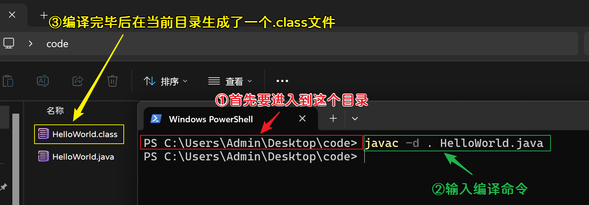

### 2.4.3 运行Java代码

将Java源代码编译为字节码文件后，我们可以使用java命令来直接运行该字节码文件，自此java程序才算是完整运行。在控制台窗口中输入如下命令。

```java
java HelloWorld
```

运行上面命令，将在控制台看到如下输出。

```shell
HelloWorld
```

需要注意的是：java命令后面跟随的是类名，并非是class文件的名称，并且运行字节码文件时也不需要加文件后缀（.class），关于什么是类名目前我们也不需要过多的深入了解，但是我们可以记住一点，通常情况下Java源代码的文件名=字节码的文件名=类名，如图所示。

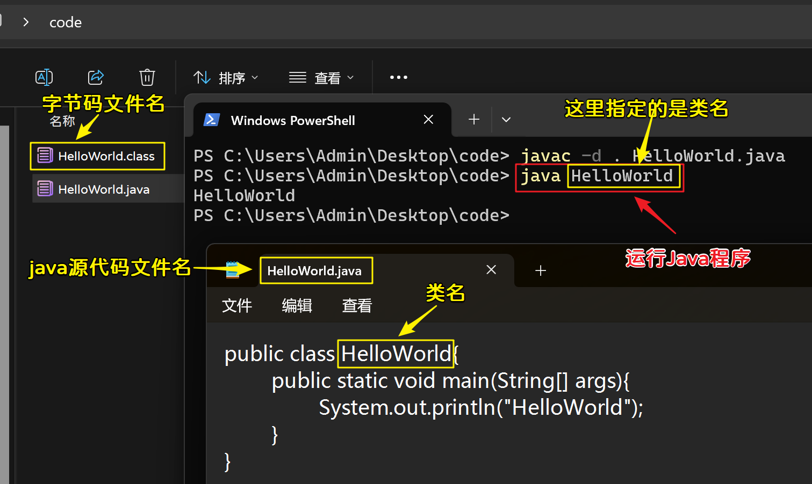

### 2.4.4 易错事项

初学者在编写第一个Java代码时会遇到的各种问题，如大小写错误、标点符号错误、代码字母错误、大括号小括号错误等。

大小写错误如图所示。

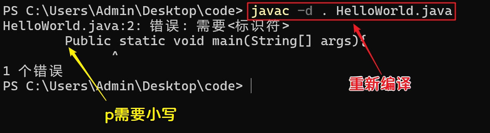

代码字母错误如图所示。

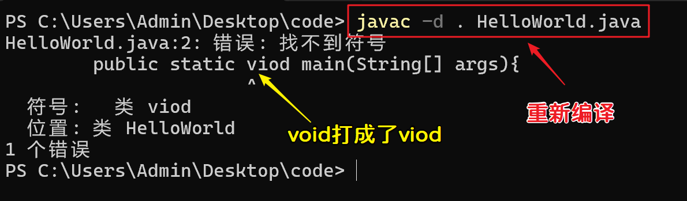

所有的标点符号应该是英文的，不能是中文，错误如图所示。

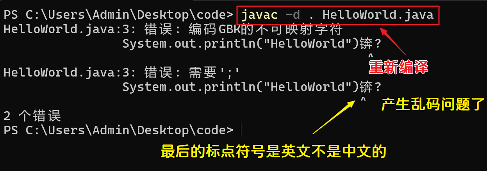

大括号与小括号必须成双成对的出现，不能多也不能少，错误如图所示。

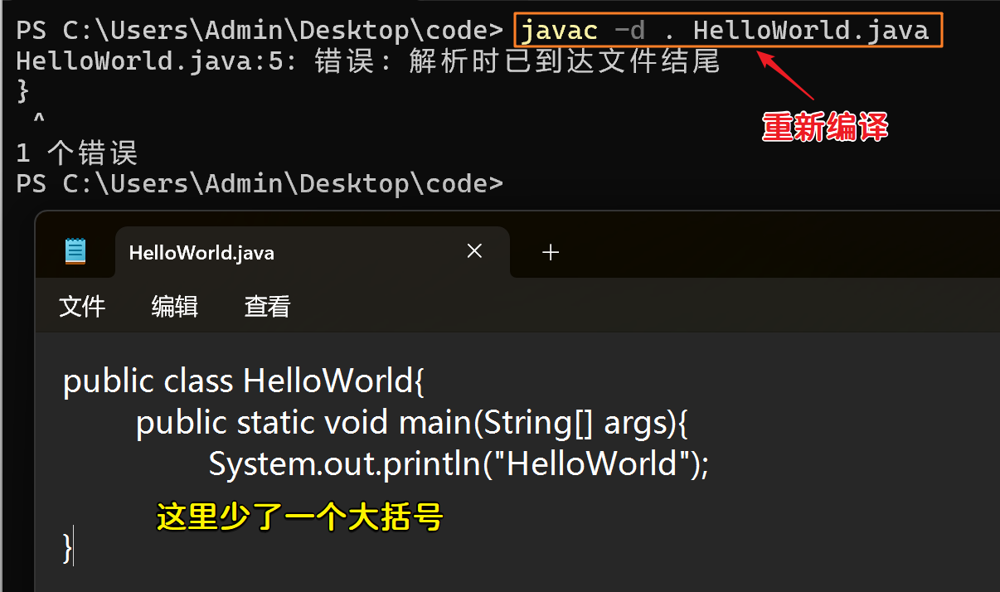


### 2.4.5 注释

注释是对代码解释和说明的文字。其目的是让人们能够更加轻松地了解代码，提高程序的可读性和可维护性。为代码添加注释，是十分必须要的，注释是给程序设计者看的，它不影响程序的编译和运行。

Java中提供了三种添加注释的方法，分别为当行注释、多行注释、文档注释等。

- 单行注释：单行注释以“//”开头，换行结束，在“//”后面的内容不会被Java解析。
- 多行注释：以`“/*”`开头，`“*/”`结束，包含在中间的内容不会被Java解析。
- 文档注释：以`“/**”`开头，`“*/”`结束，在中间的内容会被Java解析。

一个包含了注释的Java源代码如下。

```java
/**
 * 我是文档注释
 * 文档注释一般用于类、方法、方法参数的介绍等,这些注释会被javadoc工具解析
 * 只要是注释就不会被Java所解析
 */
public class HelloWorld{
    public static void main(String[] args){

        // 我是单行注释,一般用于某句代码的说明,
        System.out.println("2020-05-24: Hello World");
		
		/*
		我是多行注释,一般用于比较长的注释情况
		我是多行注释,一般用于比较长的注释情况
		*/
    }
}
```


### 2.4.6 关键字


## 2.5 常量与变量

## 2.6 Java虚拟机

我们编写的所有Java代码最终都是运行在Java虚拟机之上的，如图：

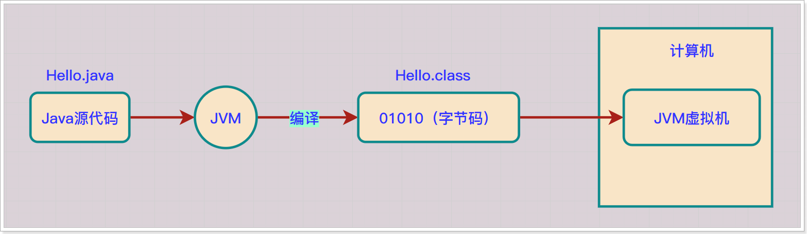

**JVM（Java Virtual Machine ）**：Java虚拟机，简称JVM，是运行所有Java程序的假想计算机，是Java程序的运行环境，是Java 最具吸引力的特性之一。我们编写的Java代码，都运行在 JVM 之上。

### 2.3.2 跨平台

**跨平台**：任何软件的运行，都必须要运行在操作系统之上，而我们用Java编写的软件可以运行在任何的操作系统上，这个特性称为Java语言的跨平台特性(“一次编写,处处运行”)。该特性是由JVM实现的，我们编写的程序运行在JVM上，而JVM运行在操作系统上。

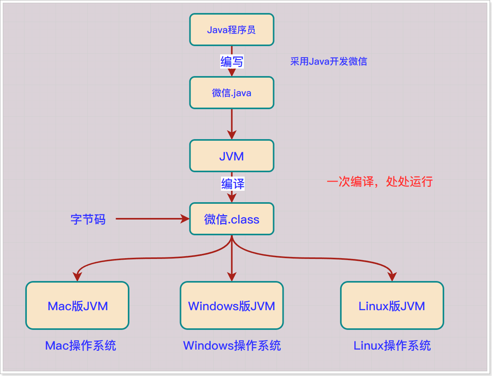

> Tips：C语言程序与操作系统有关，不同的平台（Windows、Linux）对C语言做了不同程度的支持和拓展，而Java语言与操作系统无关，因为Java代码最终运行在JVM上；

### 2.2.3 JRE和JDK和JVM的关系

基本语法

- **JDK (Java Development Kit)**：是Java程序开发工具包，包含 JRE 和开发人员使用的工具；

- **JRE (Java Runtime Environment)** ：是Java程序的运行时环境，包含 JVM 和运行时所需的**核心类库**；

- **JVM（Java Virtual Machine ）**：是一款Java虚拟机，模拟Java运行时的一个平台，对内存分配，管理、线程调度等都有一定的管理；

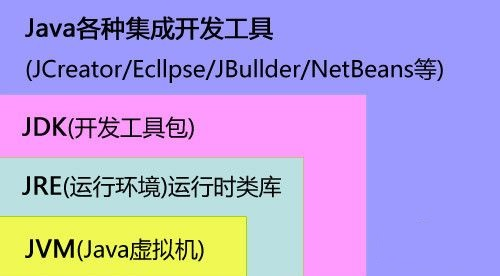

总结：

- JDK是一个Java程序员的开发工具包，除了包含JRE之外，还提供有许多Java开发工具给Java程序员使用，如Javac、JMC、Jstack等
- JRE是一个Java的运行环境，除了包含JVM之外，还提供很多的一些JavaAPI类库，为Java程序提供很多功能，如果没有这些类库那么Java程序员需要完成这些功能就需要手动编写这些逻辑代码；
- JVM是一个Java虚拟机，Java程序（class文件）最终是运行在JVM上的，他更倾向于模拟一台真实的计算机，对内存的分配，回收，共享、线程调度等功能都具备一定的管理能力；在运行Java程序的同时调用JRE提供的一些类库，使得Java程序更加强大、方便；

# 四、编写Java程序

## 4.1 搭建Java开发环境

### 4.1.1 准备一个jdk

准备一个jdk，复制到任意一个磁盘或文件夹内：

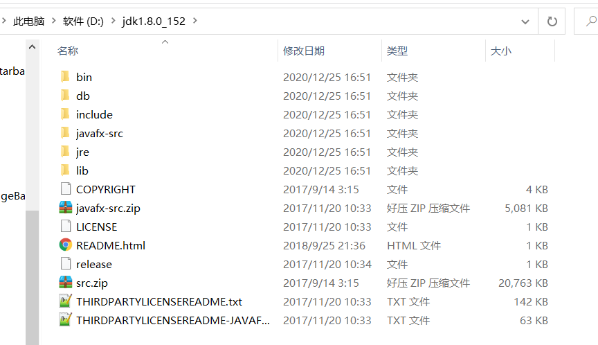

进入`bin`目录：

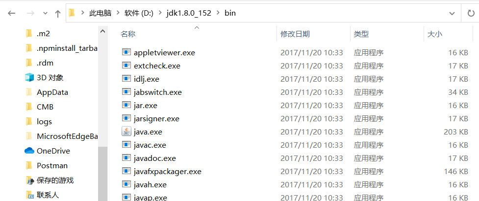

复制当前磁盘目录：`D:\jdk1.8.0_152\bin`

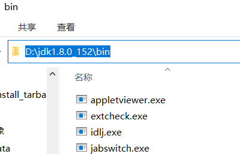


### 4.1.2 配置环境变量

计算机--->右击--->属性

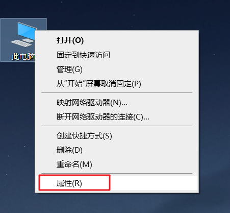

选择高级系统设置：

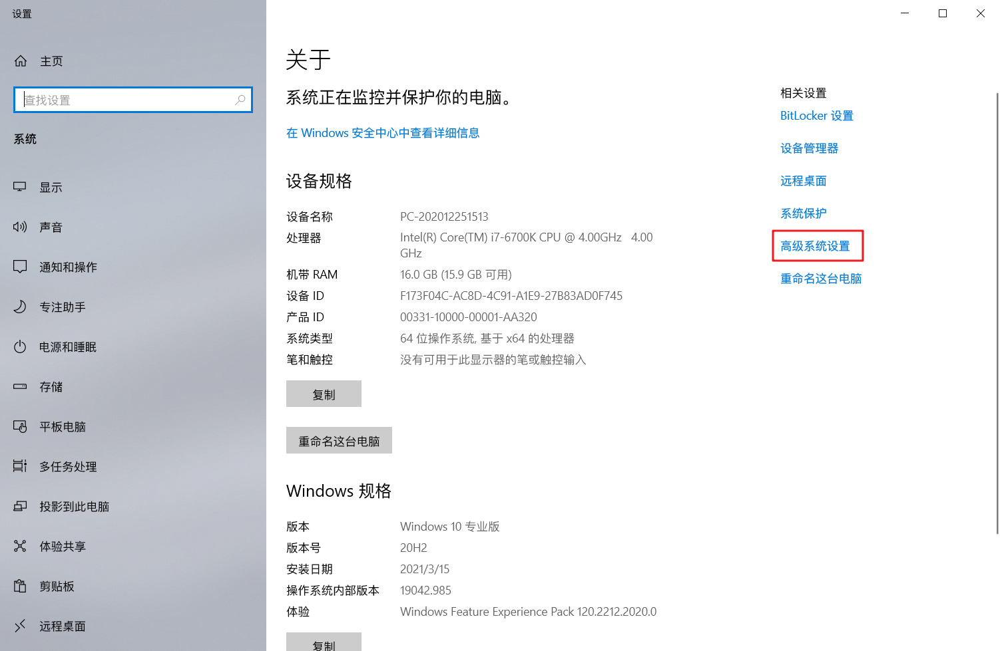


选择环境变量：

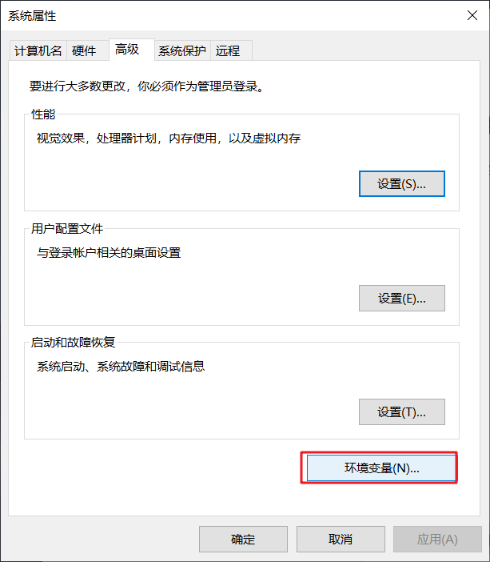


找到Path变量，点击编辑：

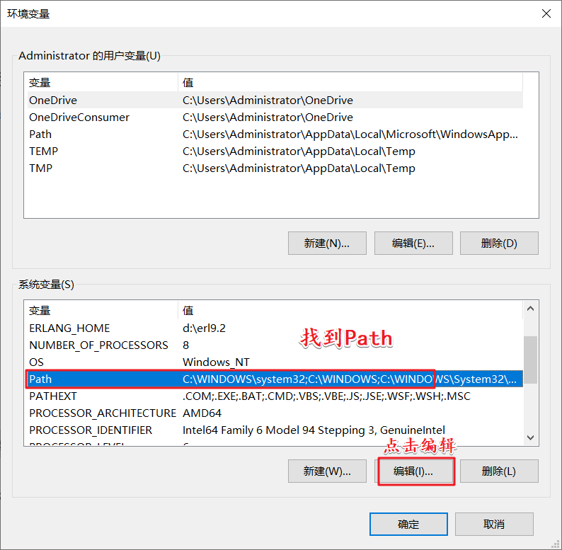


在弹出的对话框选择"编辑文本"：

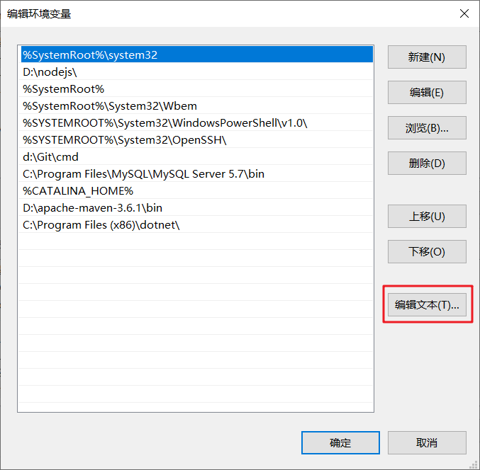


粘贴前面复制的路径：

> 一定要注意分号

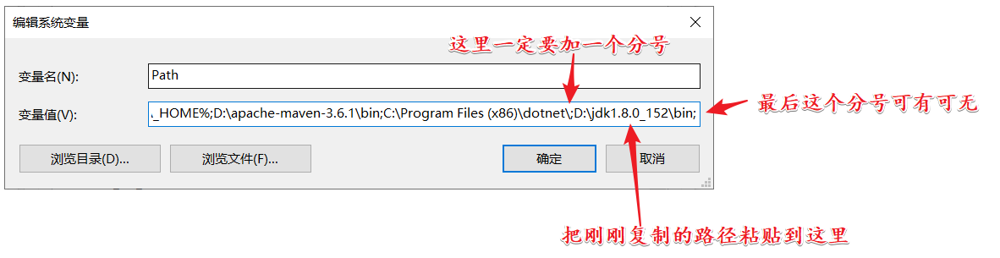

### 4.1.3 测试Java环境

打开一个新的cmd窗口（记住，一定要是新的）：输入`javac`指令，如果出现下图所示，那么就表示搭建成功

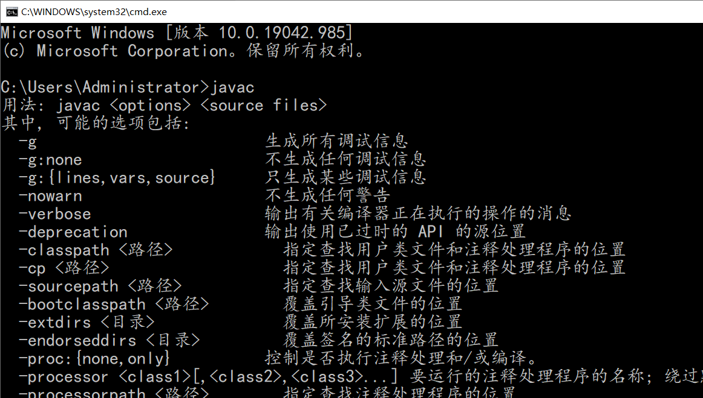


如果是出现`'javac' 不是内部或外部命令，也不是可运行的程序或批处理文件`等提示，代表环境搭建失败，如果所示：

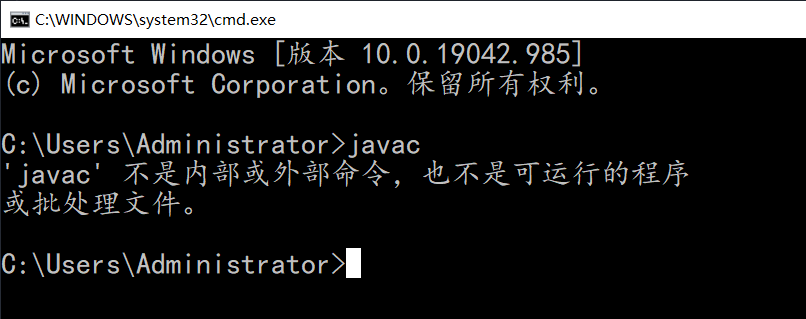

## 4.2 编写Java代码

### 4.2.1 编写源代码

Java开发环境已经搭建完毕，可以开发我们第一个Java程序了。

新建一个HelloWorld.java文件：

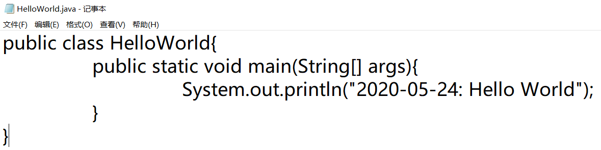

编写如下代码：

```java
public class HelloWorld{
	public static void main(String[] args){
		System.out.println("2020-05-24：Hello World！！！");
	}
}
```

> `文件名必须是 HelloWorld ，保证文件名和类的名字是一致的，注意大小写。每个字母和符号必须与示例代码一模一样。`

我们的第一个Java源程序就编写完成了，但是这个文件是程序员编写的，JVM是看不懂的，也就不能运行，因此我们必须将编写好的 Java源文件，编译成JVM可以看懂的字节码文件。

### 4.2.2 编译Java程序

在DOS命令行中，进入Java源文件的目录，使用`javac`命令进行编译。

格式如下：

`javac Java源文件名.后缀名`

示例：

`javac HelloWorld.java`


编译：

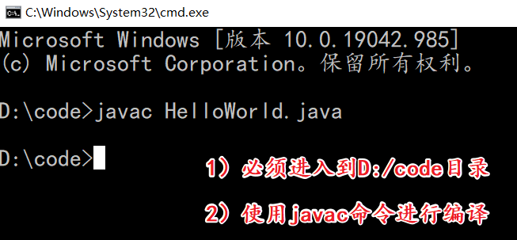

运行：

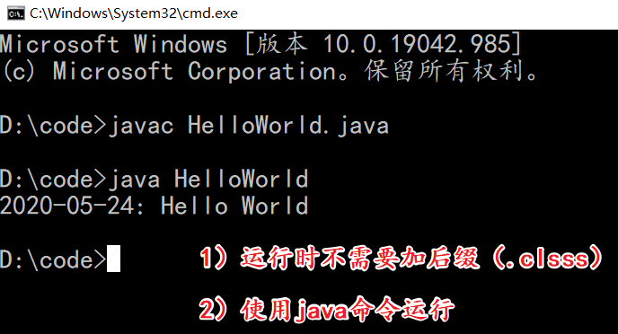

## 4.3 编译和运行

- **编译**：是指将我们编写的Java源文件翻译成JVM认识的class文件，在这个过程中， javac 编译器会检查我们

  所写的程序是否有错误，有错误就会提示出来，如果没有错误就会编译成功。

- **运行**：是指将 class文件 交给JVM去运行，此时JVM就会去执行我们编写的程序了

**关于main方法**：main方法：称为主方法。写法是固定格式不可以更改。main方法是程序的入口点或起始点，无论我们编写多
少程序，JVM在运行的时候，都会从main方法这里开始执行。


## 4.4 安装Notepad++高级记事本

Notepad（记事本）是一款开源、小巧、免费的纯文本编辑器，比Windows自带的记事本要强大很多。Notepad内置支持多达 27 种语法高亮度显示，并提供代码折叠、显示行号等功能；

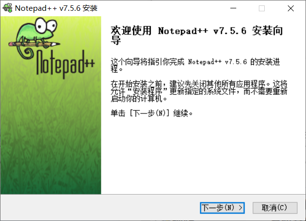

> 安装Notepad++的过程非常简单，就和我们平时安装QQ、微信等应用程序一样，这里就不一一截图了；

Notepad++安装完毕之后，以后编辑文本可以选择使用Notepad++打开：

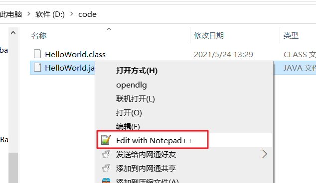


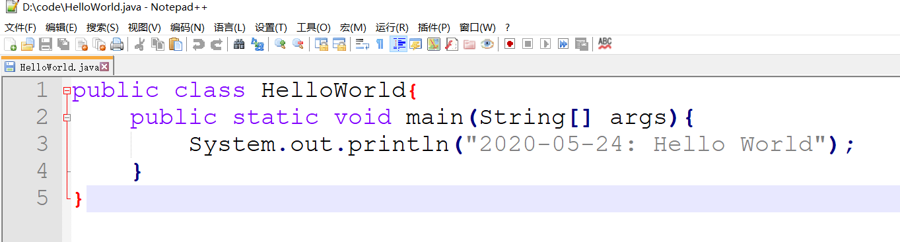

> 使用Notepad++打开后的Java程序，提供了关键字高亮、显示行号、还提供代码折叠等功能；

## 4.5 注释

注释：对代码解释和说明的文字。其目的是让人们能够更加轻松地了解代码。为代码添加注释，是十分必须要的，注释是给人看的，它不影响程序的编译和运行。

- Java中有单行注释和多行注释
  - 单行注释以`//`开头 换行结束
  - 多行注释以 `/*`开头  以`*/`结束

示例代码：

```java
public class HelloWorld{
	public static void main(String[] args){
		
		// 我是注释，给程序员看的，JVM不会执行该行代码
		System.out.println("2020-05-24: Hello World");
		
		/*
			我是注释，给程序员看的，JVM不会执行这里面的代码
			我是注释，给程序员看的，JVM不会执行这里面的代码
			我是注释，给程序员看的，JVM不会执行这里面的代码
		*/
	}
}
```


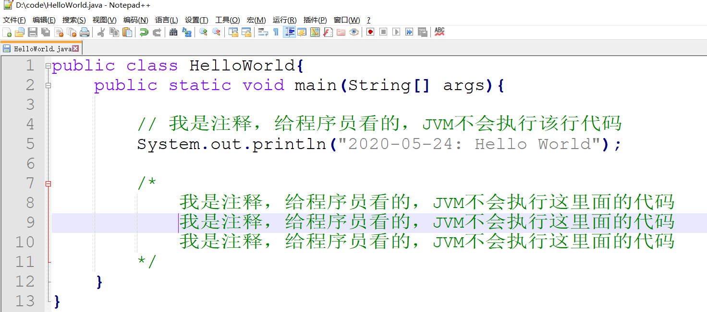


## 4.6 关键字

关键字：Java已经定义好的单词，具有特殊含义。

HelloWorld案例中，出现的关键字有 public 、 class 、 static 、 void 等，关键字全部都是**小写字母**，Notepad++中颜色特殊。

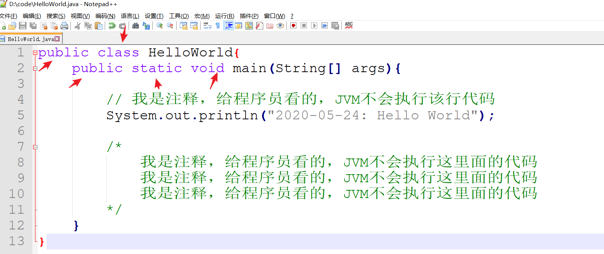

> public、class、static、void等都是关键字，具有特殊含义（功能）

- Java关键字词汇表：

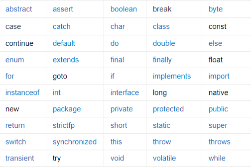

## 4.7 标识符（名字）

- **标识符**：是指在程序中，我们自己定义的名字。比如类的名字、方法的名字和变量的名字等等，都是标识符。
  - HelloWorld案例中，出现的标识符有类名字 HelloWorld 。

- **命名规则**： `硬性要求`
  - 标识符（名字）可以包含 英文字母26个(区分大小写) 、 0-9数字 、 $（美元符号） 和 _（下划线） 。
  - 标识符不能以数字开头。
  - **标识符不能是关键字**。
  - 区分大小写。

- **命名规范**： `软性建议`
  - 类名规范：每个单词首字母大写（大驼峰式）。
  - 方法名和变量名规范： 第一个单词全小写，后面每个单词首字母大写（小驼峰式）。
  - 包名规范：全部小写。

# 五、数据类型、常量、变量

## 5.1 数据类型

Java的数据类型分为两大类：

- **基本数据类型**：包括 `整数 、 浮点数 、 字符 、 布尔 `
- **引用数据类型**：包括 `类 、 数组 、 接口`

四类八种基本数据类型：

| 数据类型     | 关键字         | 内存占用 | 取值范围               |
| ------------ | -------------- | -------- | ---------------------- |
| 字节型       | byte           | 1个字节  | -128~127               |
| 短整型       | short          | 2个字节  | -32768~32767           |
| 整型         | int（默认）    | 4个字节  | -2147483648~2147483647 |
| 长整型       | long           | 8个字节  | -2的63次方~2的63次方-1 |
| 单精度浮点数 | float          | 4个字节  | 1.4013E-45~3.4028E+38  |
| 双精度浮点数 | double（默认） | 8个字节  | 4.9E-324~1.7977E+308   |
| 字符型       | char           | 2个字节  | 0-65535                |
| 布尔类型     | boolean        | 1个字节  | true，false            |


> Java中的默认类型：整数类型是 int 、浮点类型是 double；

## 5.2 常量

- 常量：是指在Java程序中固定不变的数据。

练习：输出各种类型的常量。

```java
public class Demo01 {
    public static void main(String[] args) {
        // 输出整数常量
        System.out.println(123);
		// 输出小数常量
        System.out.println(0.125);
		// 输出字符常量
        System.out.println('A');
		// 输出布尔常量
        System.out.println(true);
		// 输出字符串常量
        System.out.println("Hello Java");
    }
}
```

编译：

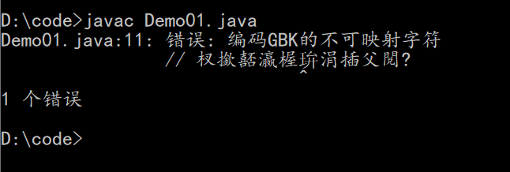

发现出现错误；这个错误是一般是因为代码中含有中文字符，注释中的中文字符也算。由于使用cmd运行java程序的时候，系统默认的编码格式是gbk。而包含中文字符的代码一般是unicode格式，所以直接运行含有中文字符的代码就很容易出现编码错误。

进行转码：

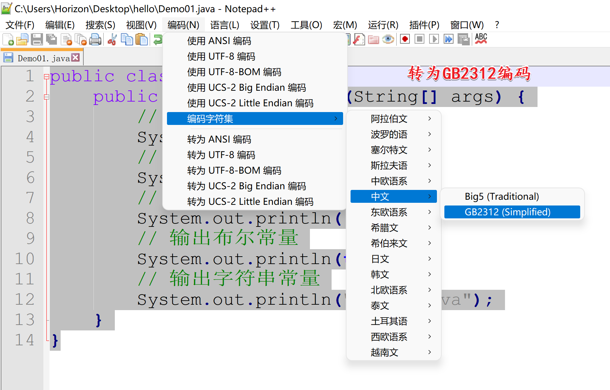

转码之后发现中文都出现乱码了：

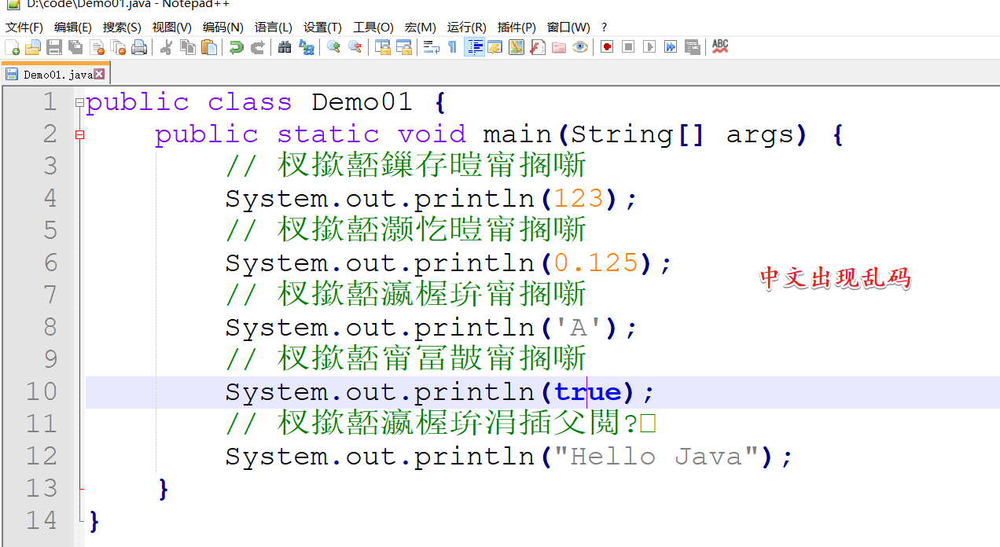


> 转码之后中文会变成乱码，因此我们以后再进行转换之前最后先复制一份；

再次编译运行：

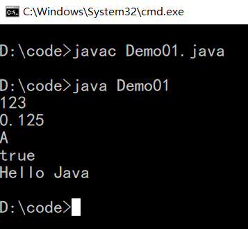

## 5.3 变量

- 变量：变量是内存中的一小块区域，其值可以在一定范围内变化

> 数学中，可以使用字母代替数字运算，例如 x=1+5 或者 6=x+5。
>
> 程序中，可以使用字母保存数字的方式进行运算，提高计算能力，可以解决更多的问题。比如x保存5，x也可以保存6，这样x保存的数据是可以改变的，也就是我们所讲解的变量。

**Java中要求一个变量每次只能保存一个数据，必须要明确保存的数据类型。**

## 5.4 变量的定义

变量定义的格式包括三个要素： 数据类型 、 变量名 、 数据值 。

练习：定义所有基本数据类型的变量，代码如下：

```java
public class Demo02 {
    public static void main(String[] args) {
        //定义字节型变量
        byte b = 100;
        System.out.println(b);
        //定义短整型变量
        short s = 1000;
        System.out.println(s);
        //定义整型变量
        int i = 123456;
        System.out.println(i);
        //定义长整型变量
        long l = 12345678900L;
        System.out.println(l);
        //定义单精度浮点型变量
        float f = 5.5F;
        System.out.println(f);
        //定义双精度浮点型变量
        double d = 8.5D;
        System.out.println(d);
        //定义布尔型变量
        boolean bool = false;
        System.out.println(bool);
        //定义字符型变量
        char c = 'A';
        System.out.println(c);
    }
}
```

> long类型：建议数据后加L表示。
>
> float类型：**数值后面必须加上F**
>
> double类型：建议数据后加D表示。
>
> 为了规范起见，我们还是统一都加上L/F/D

编译运行：

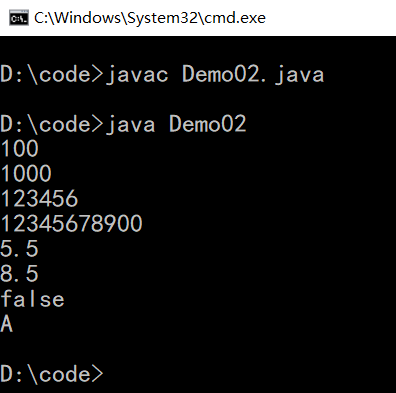

## 5.5 定义变量注意事项

1. 定义的变量，不赋值不能使用。
2. 同一个方法中变量名不能重复。
3. 变量只在定义时的{}中有效。

```java
public class Demo2 {
   
    public static void main(String[] args) {    
        int a = 10;        
        System.out.println(a);        

        int b;        
        b = 20; // 变量在使用之前一定要赋值        
        System.out.println(b); // 错误: 可能尚未初始化变量b        

        // double a = 3.1; // 错误: 已在方法 main(String[])中定义了变量 a        
        // System.out.println(a);        
        double c = 3.1; // 错误: 已在方法 main(String[])中定义了变量 a        
        System.out.println(c);        

        {        
            int d = 40;            
            System.out.println(d);            
        }        

        // System.out.println(d); // 错误: 找不到符号        
    }    
}
```

## 5.6 String类型

String类型是一种引用数据类型，用于存储字符串（多个字符），我们知道char类型只能存储单个字符，不能够存储多个字符，而String就是用于存储多个字符串的；

> 关于什么是引用数据类型我们在后面章节进行讲解；

String类型使用：

```java
public class Demo3 {
    public static void main(String[] args) {

        String str1="hello~";

        String str2="你好啊~";

        String str3="嘿嘿~";

        System.out.println(str1);
        System.out.println(str2);
        System.out.println(str3);
    }
}
```

 
